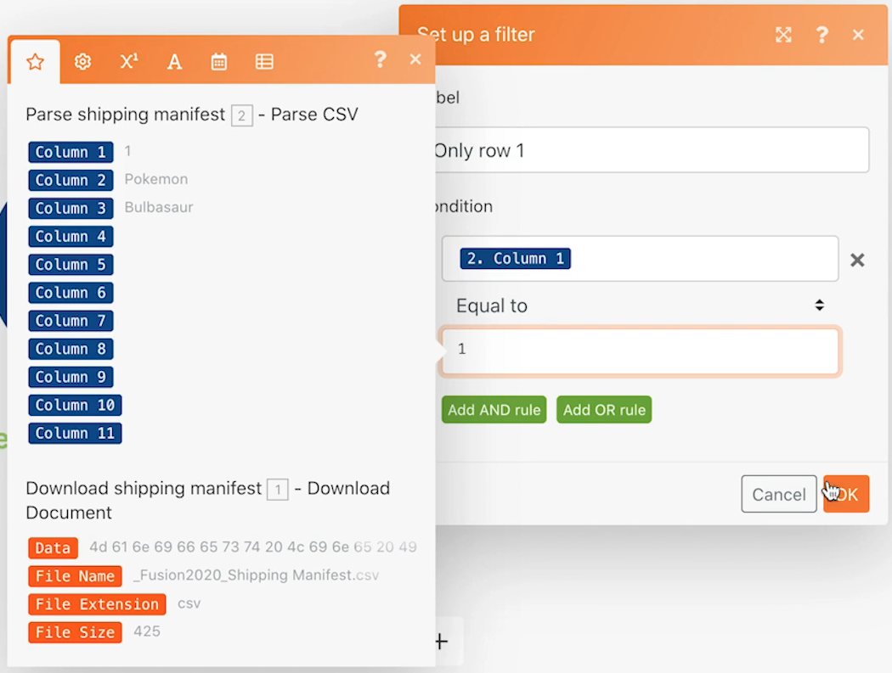

# 通用连接器简介

扩展您对使用REST通用连接器和处理返回的数据的了解。

## 练习概述

在电子表格中使用Pokemon字符，通过HTTP连接器调用Poke API，以收集并发布有关该字符的更多信息。

## 要遵循的步骤

**从Workfront下载CSV文件。**

1. 在Workfront“Fusion Exercise Files”文件夹中，选择“_Fusion2020_Shipping Manifest.csv”并单击“文档详细信息”。
1. 从URL地址复制第一个ID号。
1. 在Workfront Fusion中创建新方案。 将其命名为“使用通用连接器”。
1. 从Workfront应用程序中的下载文档模块开始。
1. 设置您的Workfront连接，并包含您从Workfront URL复制的文档ID。
1. 将此模块重命名为“下载装运清单”。

   

   **解析装运清单数据。**

1. 添加其他模块，选择解析CSV。
1. 为11列设置解析CSV 。 选中CSV包含标题框。 选择逗号分隔符类型，然后将“下载文档”模块中的数据放入CSV字段。

   

1. 将此模块重命名为“解析装运清单”。
1. 保存方案并单击运行一次，以便您能够在后续步骤中查看CSV文件中的数据。

   **使用通用连接器获取Pokemon数据。**

1. 添加HTTP Make a Request Module。
1. 在URL字段中，使用https://pokeapi.co/api/v2/pokemon/[字符]，其中 [字符] 已从解析CSV模块映射到列3。
1. 选中Parse response复选框。
1. 选择显示高级设置，然后选中“作为错误评估所有状态”旁边的复选框。
1. 单击“确定”并重命名模块“获取Pokemon信息”。

   **映射面板应当如下所示：**

   

   **在练习的这一部分中，您只想在CSV文件中处理行1。**

1. 在“获取Pokemon信息”模块之前添加过滤器。 将其命名为“仅第1行”。
1. 将条件设置为仅允许ID号1传递。 ID编号1位于第1行，ID字段位于CSV文件的第1列中。

   

1. 保存方案。
1. 单击运行一次，然后查看在HTTP发出请求模块中收到的错误消息。

   >[!IMPORTANT]
   >
   >请注意，在输入数据URL字段中，字符名称会大写。 由于字符名称需要小写，因此无法进行该API调用。

   

1. 使用HTTP发出请求URL字段中的映射面板来 [字符] 字段使用 **lower** 函数。

   

   **使用设置多个变量模块从API映射信息。**

1. 在获取Pokemon信息后添加设置多个变量模块。 映射名称、高度、权重和功能。
1. 由于“功能”字段是数组，因此请记住使用映射函数访问数组中每个功能的名称。

   

   **在没有过滤器的情况下运行方案以发现另一个错误。**

1. 要处理CSV文件中的所有行，请删除名为仅第1行的过滤器：

   + 单击过滤器图标以对其进行编辑。
   + 删除过滤器标签。
   + 删除条件。
   + 单击确定。

1. 保存方案，然后单击运行一次。
1. 获取Pokemon信息模块中出错。 您会看到超级英雄角色已传递到Pokemon API。

   >[!NOTE]
   >
   >在路由器演练中，您将看到如何通过创建单独的路径来处理超级英雄来解决此错误。

   