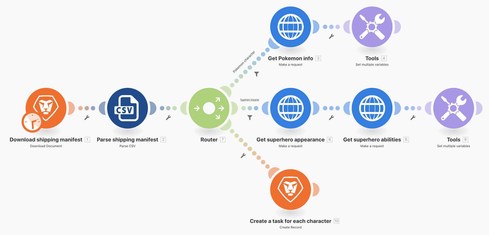
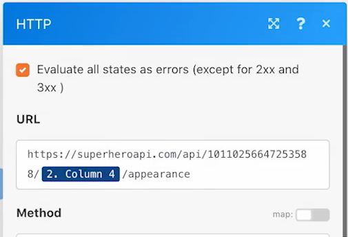

# 路由器练习

了解路由器的重要性，以及如何使用它们来有条件地处理不同的模块。

## 练习概述

使用路由器将宠物小精灵与超级英雄捆绑包沿着正确的路径传递，然后为每个角色创建一个任务。

## 应遵循的步骤

1. 克隆上一个练习中的使用通用连接器场景。将其命名为“使用路由器创建不同的路径”。

   **通过克隆模块和添加路由器为超级英雄创建一条新路径。**

   

1. 右键单击“获取宠物小精灵信息”模块并选择“克隆”。克隆后，将其拖动并连接到新 HTTP 模块和解析 CSV 模块之间的线上。

   >[!NOTE]
   >
   > 请注意它是如何自动添加具有两条路径的路由器。

1. 将此模块命名为“获取超级英雄外观”。
1. 克隆此模块，将克隆内容移动到右侧，并将其命名为“获取超级英雄能力”。
1. 克隆“工具”模块，并将其移动到第二条路径的末尾。
1. 单击工具栏中的魔杖图标——自动对齐按钮。

   **您的场景应该如下所示：**

   

   **接下来，您将会更改新克隆模块中的映射值。**

1. 转到 <https://www.superheroapi.com/>，并使用您的 Facebook 帐户获取访问令牌。

   >[!NOTE]
   >
   >如果您在访问自己的超级英雄令牌时遇到问题，可以使用此共享令牌：10110256647253588。请注意您调用超级英雄 API 的次数，以便其他人可以继续使用该共享令牌。

1. 打开“获取超级英雄外观”的设置并将 URL 更改为 `https://www.superheroapi.com/api/[access- token]/332/appearance`。请一定要在 URL 中加入您的访问令牌。单击“确定”。
1. 打开“获取超级英雄能力”的设置并将 URL 更改为 `https://www.superheroapi.com/api/[access- token]/332/powerstats`。请一定要在 URL 中加入您的访问令牌。单击“确定”。
1. 右键单击每个超级英雄模块，并选择“仅运行此模块”。这将会生成您需要看到的映射数据结构。
1. 运行两者后，将每个 URL 字段中的数字“332”更改为从解析 CSV 模块映射的“第 4 列”。

   

   **现在您可以单击超级英雄路径中的“设置多个变量”模块，并更新姓名、身高、体重和能力。**

1. 更新“获取超级英雄能力”模块（模块 8）中的名称和能力字段。

   

1. 更新“获取超级英雄外观”模块（模块 6）中的身高和体重字段。

   

   **完成后，您的变量应如下所示。请注意，模块编号会出现在字段值中。**

   

1. 单击“确定”，然后保存您的场景。

   **创建另一条路径来为每个角色创建一个任务。**

1. 在 Workfront 中，创建一个空项目。将其命名为“运输清单项目”并从 URL 中复制项目 ID。
1. 返回 Workfront Fusion，并单击路由器的中心，以创建另一条路径。

   

1. 单击出现的空模块的中心，然后从 Workfront 应用程序中添加“创建记录”模块。
1. 将“记录类型”设置为“任务”，然后从“要映射的字段”部分选择“项目 ID”。
1. 将从 Workfront 复制的项目 ID 粘贴到“项目 ID”字段中。
1. 现在，从“要映射的字段”部分中选择“名称”字段。
1. 将任务命名为“[系列]中的[角色]”，采用 CSV 文件中的角色名称和系列名称。第 3 列是角色名称，第 2 列是系列名称。

   

1. 单击“确定”，然后将此模块重命名为“为每个角色创建任务”。

   **添加过滤器，以便该场景可以正确运行。您希望只有宠物小精灵角色沿着顶部路径走，只有超级英雄角色沿着中间路径走，所有角色都沿着底部路径走。**

1. 单击“获取宠物小精灵信息”模块左侧的虚线，以创建第一个过滤器。将其命名为“宠物小精灵角色”。
1. 对于该条件，仅允许系列（第 2 列）等于“宠物小精灵”的记录。选择文本“等于”运算符。
1. 单击“获取超级英雄外观”模块左侧的虚线，以创建下一个过滤器。将其命名为“超级英雄角色”。
1. 由于超级英雄可能来自不同的系列，因此请使用超级英雄 ID 字段（第 4 列）来确定某个角色是否是超级英雄。

   **您的过滤器应该如下所示：**

   

   

1. 保存该场景并单击“运行一次”。使用执行检查器验证所有操作是否成功，并检查在 Workfront 项目中创建的任务。

   
