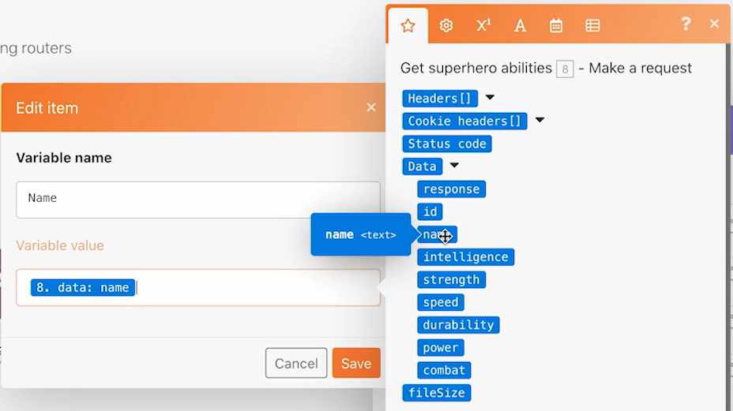

# 路由器

了解路由器的重要性以及如何根据条件处理不同模块。

## 练习概述

使用路由器将Pokemon与超级英雄捆绑到正确的路径中，然后为每个字符创建一个任务。

## 要遵循的步骤

1. 从上一个练习中克隆使用通用连接器方案。 将其命名为“使用路由器创建不同的路径”。

   **通过克隆模块和添加路由器为超级英雄创建新路径。**

   

1. 右键单击“获取Pokemon信息”模块，然后选择“克隆”。 克隆后，将其拖动并连接到新HTTP模块与解析CSV模块之间的行。

   >[!NOTE]
   >
   > 请注意它如何自动添加具有两条路径的路由器。

1. 将此模块命名为“获取超级英雄外观”。
1. 克隆此模块，将克隆移到右侧，并将其命名为“获取超级英雄能力”。
1. 克隆“工具”模块并将其移动到第二个路径的末尾。
1. 单击工具栏中的棒图标（自动对齐按钮）。

   **您的方案应当如下所示：**

   

   **接下来，您将更改新克隆模块中映射的值。**

1. 转到 <https://www.superheroapi.com/> 并使用您的Facebook帐户获取访问令牌。

   >[!NOTE]
   >
   >如果您在访问自己的超级英雄令牌时遇到问题，您可以使用此共享令牌：10110256647253588。 请考虑您调用超级英雄API的次数，以便此共享令牌可继续适用于所有人。

1. 打开“获取超级英雄外观”的设置，并将URL更改为https://www.superheroapi.com/api/[访问令牌]/332/外观。 确保在URL中包含您的访问令牌。 单击确定。
1. 打开获取超级英雄能力的设置，并将URL更改为https://www.superheroapi.com/api/[访问令牌]/332/powerstats。 确保在URL中包含您的访问令牌。 单击确定。
1. 右键单击每个超级英雄模块，然后选择“仅运行此模块”。 这将生成映射所需要查看的数据结构。
1. 运行这两个模块后，将每个URL字段中的数字“332”更改为从解析CSV模块映射的第4列。

   

   **现在，您可以单击超级英雄路径中的设置多个变量模块，并更新名称、高度、权重和功能。**

1. 更新“获取超级英雄能力”模块（模块8）中的“名称”和“能力”字段。

   

1. 从获取超级英雄外观模块（模块6）中更新“高度”和“重量”字段。

   

   **完成后，变量应如下所示。 请注意，模块编号显示在字段值中。**

   

1. 单击确定，然后保存方案。

   **创建另一个路径以按字符创建任务。**

1. 在Workfront中，创建一个空项目。 将其命名为“Shipping Manifest Project”，并从URL复制项目ID。
1. 返回Workfront Fusion ，然后单击路由器中心以创建其他路径。

   

1. 单击显示的空模块的中心，然后从Workfront应用程序中添加创建记录模块。
1. 将记录类型设置为任务，然后从要映射的字段部分选择项目ID。
1. 将您从Workfront复制的项目ID粘贴到项目ID字段中。
1. 现在，从要映射的字段部分中选择名称字段。
1. 将任务命名为“[字符] 从 [特许权]，”从CSV文件获取字符名和特许经营权名称。 第3栏是字符名称，第2栏是特许权的名称。

   

1. 单击“确定”，然后将此模块重命名为“为每个字符创建任务”。

   **添加过滤器，以便方案可以在运行时不出错。 你只希望“波克门”角色沿着最上方的路径前进，只希望超级英雄角色沿着中间的路径前进，希望所有角色沿着最下方的路径前进。**

1. 单击“获取Pokemon信息”模块左侧的虚线以创建第一个过滤器。 将其命名为“Pokemon character”。
1. 对于条件，仅允许特许权（第2栏）等于“Pokemon”的记录。 选择文本“等于”运算符。
1. 单击获取超级英雄外观模块左侧的虚线，以创建下一个过滤器。 将其命名为“超级英雄人物”。
1. 由于超级英雄可以来自各种特许经营，因此请使用“超级英雄ID”字段（第4栏）来确定角色是否是超级英雄。

   **您的过滤器应当如下所示：**

   

   

1. 保存方案，然后单击运行一次。 使用执行检查器来验证所有操作是否成功，并检查在您的Workfront项目中创建的任务。

   
