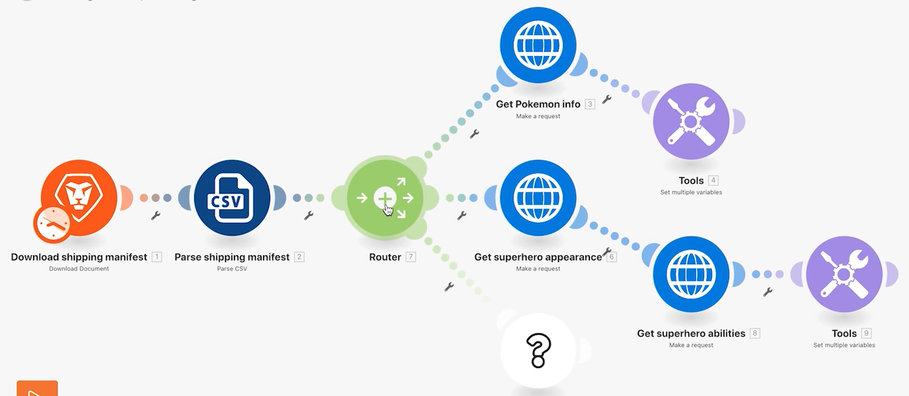

# 路由器

了解路由器的重要性以及如何使用它们有条件地处理不同的模块。

## 练习概述

使用路由器将“精灵宝可梦”与“超级英雄”捆绑包传递到正确的路径，然后为每个字符创建一个任务。

## 要遵循的步骤

1. 克隆上一个练习中的使用通用连接器场景。 将其命名为“Creating different paths using router（使用路由器创建不同的路径）”。

   **通过克隆模块并添加路由器，为超级英雄创建新的路径。**

   

1. 右键单击“获取Pokémon信息”模块，然后选择“克隆”。 克隆后，将其拖动并连接到新HTTP模块和Parse CSV模块之间的行。

   >[!NOTE]
   >
   > 请注意它如何自动添加具有两条路径的路由器。

1. 将此模块命名为“获取超级英雄外观”。
1. 克隆此模块，将克隆移动到右侧，并将其命名为“获取超级英雄能力”。
1. 克隆“工具”模块并将其移动到第二个路径的末尾。
1. 单击工具栏中的棒图标 — “自动对齐”按钮。

   **您的方案应如下所示：**

   

   **接下来，您将更改新克隆模块中的映射值。**

1. 转到 <https://www.superheroapi.com/> 并使用您的Facebook帐户获取访问令牌。

   >[!NOTE]
   >
   >如果您在访问自己的超级英雄令牌时遇到问题，可以使用此共享令牌：10110256647253588。 请注意您调用超级英雄API的次数，以便此共享令牌继续适用于每个人。

1. 打开获取超级英雄外观的设置，并将URL更改为 `https://www.superheroapi.com/api/[access- token]/332/appearance`. 请确保在URL中包含您的访问令牌。 单击“确定”。
1. 打开获取超级英雄功能的设置，并将URL更改为 `https://www.superheroapi.com/api/[access- token]/332/powerstats`. 请确保在URL中包含您的访问令牌。 单击“确定”。
1. 右键单击每个Superhero模块，然后选择“仅运行此模块”。 这将生成映射时需要查看的数据结构。
1. 运行这两个字段后，将每个URL字段中的数字“332”更改为从“解析CSV”模块映射的“列4”。

   

   **现在，您可以单击超级英雄路径中的设置多个变量模块，并更新名称、高度、权重和功能。**

1. 从“获取超级英雄能力”模块（模块8）中更新“名称”和“能力”字段。

   

1. 从Get superhero外观模块（模块6）中更新Height和Weight字段。

   

   **完成后，您的变量应如下所示。 请注意，模块编号显示在字段值中。**

   

1. 单击确定，然后保存方案。

   **创建其他路径以按字符创建任务。**

1. 在Workfront中，创建一个空项目。 将其命名为“Shipping Manifest Project”，并从URL中复制项目ID。
1. 返回到Workfront Fusion并单击路由器中央以创建另一条路径。

   

1. 单击显示的空模块的中央，然后从Workfront应用程序添加一个创建记录模块。
1. 将记录类型设置为任务，然后从要映射的字段部分中选择项目ID 。
1. 将您从Workfront复制的项目ID粘贴到项目ID字段。
1. 现在，从“要映射的字段”部分中选择“名称”字段。
1. 将任务命名为&quot;[字符] 起始日期 [特许经营]，”获取CSV文件中的字符名称和特许经营名称。 列3是字符名称，列2是特许经营的名称。

   

1. 单击确定，然后将此模块重命名为“为每个字符创建任务”。

   **添加过滤器，以便场景可以正常运行，而不会出现错误。 你只想让《神奇宝贝儿》中的角色沿着最上方的路径走，只想让超级英雄中的角色沿着中间路径走，让所有角色沿着最下方的路径走。**

1. 单击“获取Pokémon信息”模块左侧的虚线以创建第一个过滤器。 将其命名为“神奇宝贝角色”。
1. 对于条件，仅允许特许经营（第2列）等于“神奇宝贝”的记录。 选择文本“等于”运算符。
1. 单击Get superhero外观模块左侧的虚线以创建下一个过滤器。 把它命名为“超级英雄角色”。
1. 由于超级英雄可能来自各种特许经营权，因此请使用Superhero ID字段（第4列）确定角色是否为超级英雄。

   **您的过滤器应如下所示：**

   

   

1. 保存方案并单击运行一次。 使用执行检查器验证所有操作是否成功，并检查在Workfront项目中创建的任务。

   
