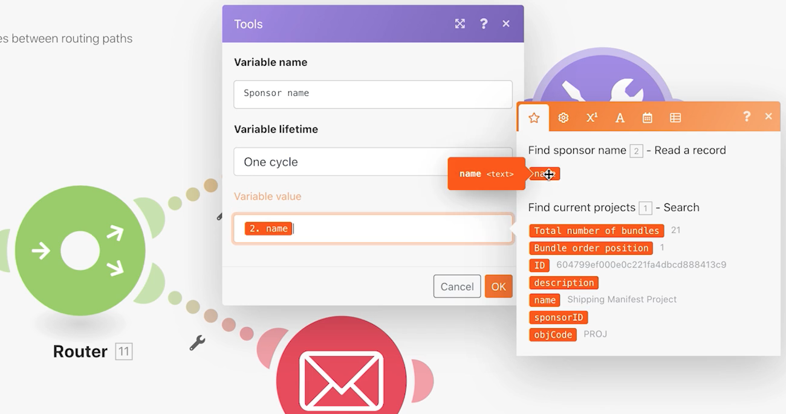

# 设置/获取变量练习

了解如何使用“设置变量”和“获取变量”模块在不同路径中使用一个路径中可用的字段。

## 练习概述

在 Workfront 中查找有关项目的信息并发送包含相关信息的电子邮件。

## 应遵循的步骤

1. 创建一个新场景，并将其命名为“在路由路径之间共享变量”。
1. 对于触发器，选择 Workfront 应用程序中的“搜索”模块。

   + 将记录类型设置为“项目”。
   + 对于结果集，选择“所有匹配的记录”。
   + 对于搜索条件，将其设置为“状态等于 CUR”。
   + 对于输出，选择“ID”、“名称”、“描述”和“发起人 ID”。

   

   

1. 单击“确定”并将该模块重命名为“查找当前项目”。
1. 添加另一个模块并选择“Workfront 读取记录”模块。

   + 对于记录类型，选择“用户”。
   + 对于输出内容，选择“名称”。
   + 将发起人 ID 从“搜索”模块映射到 ID 字段。

1. 单击“确定”。
1. 将该模块重命名为“查找发起人名称”。

   

1. 保存该场景并单击“运行一次”。

   如果您在“读取记录”模块上收到错误，可能是因为“搜索”模块找到了未列出发起人的项目。

   **为了避免此错误，请创建两条路径：一条用于具有发起人 ID 的项目，另一条用于没有发起人 ID 的项目。**

1. 单击路由器和“读取记录”模块之间的扳手图标，在这两个模块之间添加路由器。设置名为“发起人存在”的过滤器，并将条件设置为“发起人 ID 存在”。

   

1. 单击路由器以创建另一条路径。从电子邮件应用程序添加“发送电子邮件”模块。

   + 在“收件人”字段中输入您自己的电子邮件地址。
   + 在“主题”字段中，输入“当前项目信息”。
   + 在“内容”字段中，输入项目名称、描述和发起人。
   + 您无法从“读取记录”模块中提取发起人名称输出内容。您只能从路由器之前的“搜索”模块访问发起人 ID。您需要找到一种方法从其他路由器路径访问发起人名称。

   

1. 现在单击“确定”，然后将此模块重命名为“发送项目信息”

   **使用“设置”/“获取”变量在不同路径之间共享数据。**

1. 在“查找发起人名称”模块之后，添加一个“设置变量工具”模块。

   + 将“发起人名称”作为变量名称。
   + 将变量存留期保留为“一个周期”。
   + 将该字段映射到“查找发起人名称”模块输出的名称。

1. 单击“确定”，然后将该模块重命名为“设置发起人名称”。

   

1. 接下来，在路由器和“发送电子邮件”模块之间右键单击以添加“获取变量工具”模块。在“变量名称”字段中输入“发起人名称”。
1. 单击“确定”。将该模块重命名为“获取发起人名称”。

   

1. 返回“发送电子邮件”模块，并将“获取发起人名称”模块中的值映射到内容字段。单击“确定”。

   

   >[!IMPORTANT]
   >
   >在测试场景之前，我们建议限制您处理的项目数量，以避免收到大量电子邮件。

1. 前往 Workfront 测试版，并找到 Northstar Fashion Exhibitors Booth 项目。这是一个有发起人的当前项目。从 URL 复制项目 ID。

   

1. 在您的场景中，单击“查找当前项目”模块。单击绿色的“添加 AND 规则”按钮，向搜索条件添加另一个条件。指定 ID 必须等于您复制的项目 ID。单击“确定”。
1. 保存您的场景并单击“运行一次”。
1. 查看执行检查器和您收到的电子邮件。

   
