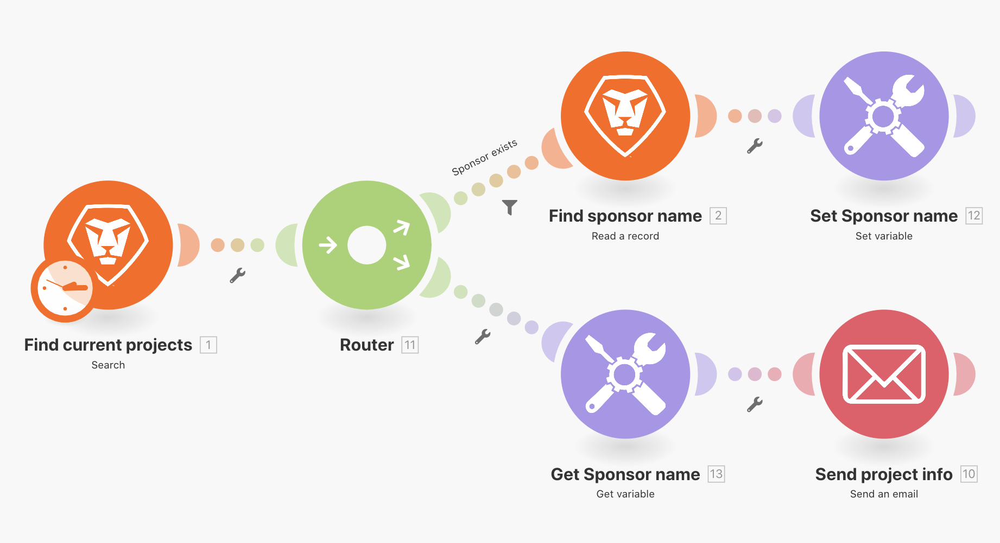

# 切换功能练习

了解如何使用“切换”功能。

## 练习概述

对于简单的数据更改，请使用“切换”功能将模块字段中的一个值转换为另一个值。 在此练习中，将两个字母的键更改为要在电子邮件中发送的项目进度状态的实际名称。

## 应遵循的步骤

1. 克隆名为“在路由路径之间共享变量”的场景。
1. 将新场景命名为“在路由路径之间共享变量 - 切换”。
1. 单击触发器模块并将“进度状态”添加到输出部分。
1. 在发送电子邮件模块中，将“进度状态”添加到内容字段。

   + 如果您只是映射来自“搜索”模块的值，则会有一个表示进度状态的两个字母的代码。
   + 要“切换”每项可能的“进度状态”完整名称的代码，请使用“通用”功能选项卡中的“切换”功能。

1. 切换功能会使用“进度状态”值或表达式作为键，然后根据该键返回输出值。

   + 键值在进度状态 (&quot;LT&quot;) 之后的第一个位置中定义，而相应的输出则在第二个位置 (&quot;Late&quot;) 中定义。
   + 下一个键值在第三个位置定义，而相应的输出则在第四个位置定义，依此类推，可根据需要定义多个键。

     
