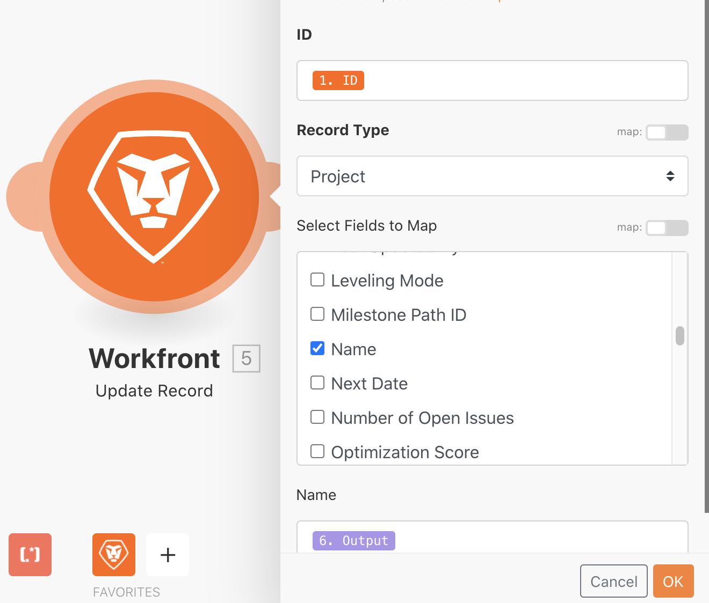

# 切换模块练习

了解当您需要执行更复杂或动态的数据转换时如何使用“切换”模块。

## 练习概述

在您的测试版中搜索直邮项目，然后根据附加到项目的自定义字段中选择的值更改每个项目的名称。

## 应遵循的步骤

1. 创建一个新场景并将其命名为“使用‘切换’模块”。
1. 对于触发器模块，请使用 Workfront“搜索”模块。
1. 设置您的 Workfront 连接，并将记录类型设置为“项目”。
1. 在搜索条件中，指定您只希望查看在“渠道”自定义字段中具有值的项目。
1. 对于输出内容，选择 ID、名称、参考号和渠道自定义字段。

   

1. 从工具中添加“切换”模块。
1. 对于输入字段，映射“搜索”模块中的“渠道”自定义字段。

   

1. 接下来，为来自渠道自定义字段的每个可能值添加案例。可能的值放在“模式”字段中。建议您在输出字段中包含特定的 3 个字母代码，后跟项目参考号，然后是项目名称。

   **您的映射面板应如下所示：**

   

1. 您可以添加任意数量的其他案例。请注意底部的 Else 字段。如果输入值与任何案例都不匹配，则会使用此字段。

   **更新 Workfront 中的项目名称。**

   

1. 添加 Workfront 更新记录模块。
1. 在 ID 字段中，映射到触发器模块的 ID。
1. 将记录类型设置为“项目”。
1. 从“选择要映射的字段”部分中选择“名称”字段，并将其映射到“切换”模块的输出。
1. 保存您的场景并“运行一次”。在您的测试版中查看更新的项目名称。
