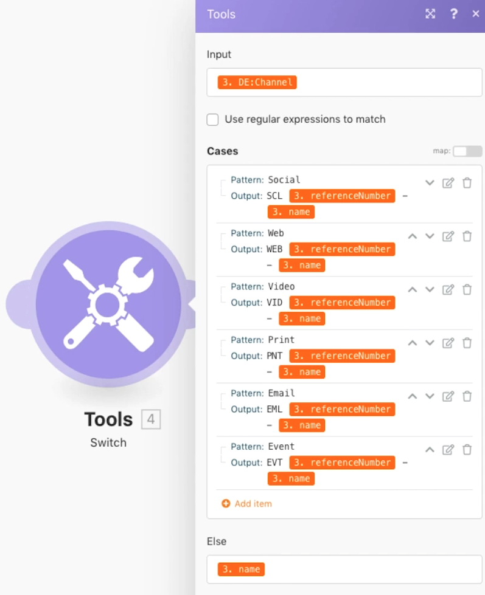

# 开关模块

了解在需要执行更复杂或动态的数据转换时，如何使用切换模块。

## 练习概述

在您的测试驱动器中搜索直邮项目，然后根据在附加到项目的自定义字段中选择的值更改每个项目的名称。

## 要遵循的步骤

1. 创建新方案并将其命名为“Using the Switch module”。
1. 对于触发器模块，使用Workfront搜索模块。
1. 设置您的Workfront连接，并将记录类型设置为“项目”。
1. 在搜索标准中，指定您只想在渠道自定义字段中看到具有值的项目。
1. 对于输出，选择ID、名称、引用编号和渠道自定义字段。

   

1. 从“工具”中添加“切换”模块。
1. 对于“输入”字段，从“搜索”模块映射“渠道”自定义字段。

   

1. 接下来，为来自渠道自定义字段的每个可能值添加大小写。 可能的值将位于“模式”字段中。 您希望输出字段包含一个特定的3个字母代码，后跟项目引用编号，然后是项目名称。

   **映射面板应当如下所示：**

   

1. 您可以添加任意所需数量的其他案例。 请注意底部的Else字段。 如果输入值与任何情况都不匹配，则将使用此参数。

   **在Workfront中更新项目名称。**

   

1. 添加Workfront更新记录模块。
1. 在ID字段中，映射到触发器模块中的ID。
1. 将记录类型设置为“项目”。
1. 从选择要映射的字段部分中选择名称字段，然后将其映射到交换机模块的输出。
1. 保存方案并运行一次。 在您的测试驱动器中查看更新的项目名称。
