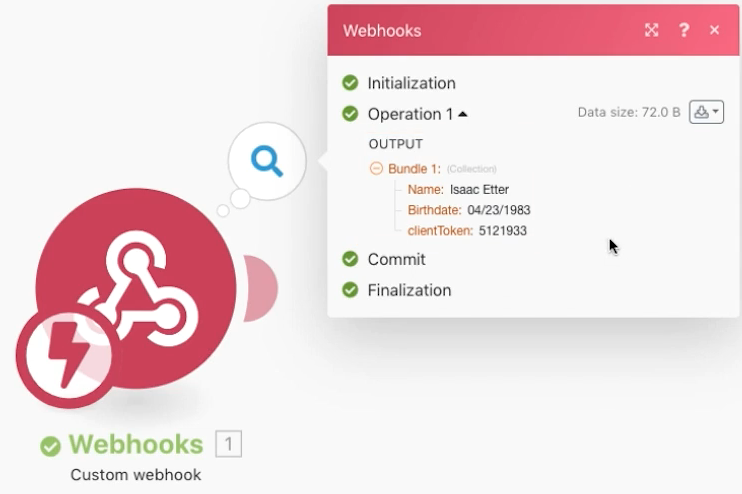
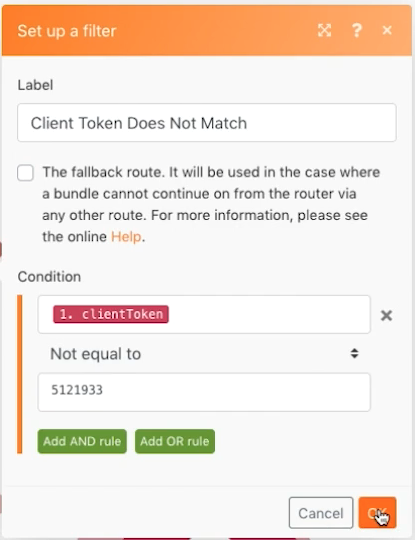

# Webhooks练习

了解如何创建、触发和管理 Webhook 启动的场景。

## 练习概述

此场景的目的是创建一个向便利店销售的应用程序，以便他们可以轻松确定顾客的年龄是否足以购买酒精饮料。收银员只需将顾客的姓名和出生日期发布到向他们提供的 URL 上即可。这个发布请求将触发场景，计算答案并将其返回给请求者。

1. 该场景由三个 Webhook 组成。
1. 触发器模块是一个侦听发布请求的自定义 Webhook。
1. 当它收到发布请求时，会将其输出到下一个模块之一。
1. 下一个模块向请求者返回响应。

   

## 应遵循的步骤

**设置触发器 Webhook。**

1. 创建一个新场景并将其命名为“Using webhooks”。
1. 对于触发器，从 Webhook 应用程序添加自定义 Webhook 模块。
1. 单击“添加”以创建一个新 Webhook。
1. 输入“饮酒年龄应用程序”的 Webhook 名称。
1. 将 IP 限制留空，这意味着任何人都可以向其中发送数据。
1. 单击“保存”。

   

1. 返回 Webhook 映射面板，其中已为此特定 Webhook 创建了一个 URL。单击“将地址复制到剪贴板”以复制该 URL。
1. 单击“确定”。
1. 单击“运行一次”。
1. 使用 Postman 中的 URL 将姓名和出生日期发送到您的自定义 Webhook。有关设置 Postman 的说明，请参阅 [Webhook 演练](https://experienceleague.adobe.com/docs/workfront-learn/tutorials-workfront/fusion/beyond-basic-modules/webhooks-walkthrough.html?lang=zh-Hans)教程。

   **Webhook 模块面板应如下所示：**

   

   **Webhook 现在处于侦听数据以确定数据结构的状态。**

1. 您可以定义您期望获得的有效负载的数据结构（数据结构将在稍后讨论）。如果您未定义数据结构，Fusion 将在发送发布请求时自动确定数据结构。
1. 在 Postman 端，您要发送到复制的 URL。该发布请求应包含基本表单数据。对于此示例，您需要三个字段：Name、Birthdate 和 clientToken。

   

1. 单击“从 Postman 发送”后，您应该会收到一条指示，表明该发布请求已被接受。
1. 此时您的场景将显示数据结构已成功确定。
1. 打开执行检查器可以看到数据已经收到。

   

   **设置客户端令牌的路由。**

1. 将路由器添加到触发器模块。
1. 在上面的路径中，添加 Webhook 响应模块。当客户端令牌不匹配时，这将会是我们的路径。
1. 将状态设置为 401。
1. 将正文设置为 {&quot;error&quot;: &quot;Failed to authenticate request. Please check your clientToken&quot;}.

   

1. 在路由器和 Webhook 响应模块之间创建过滤器。将其命名为“客户端令牌不匹配”。
1. 对于条件，使用触发器模块中的 clientToken 字段，并与数字 5121933 进行数字“不等于”比较。

   

1. 在底部路径中，添加另一个 Webhook 响应模块。当客户端令牌匹配时，这将会是我们的路径。
1. 将状态设置为 200。
1. 在设置“正文”时，使用映射面板功能来测试该人是否年满 21 岁。如果是，则返回“您已经到了可以喝酒的年龄了！”，否则返回“您运气不好……”

   

1. 在较低路径上的路由器和 Webhook 响应模块之间创建过滤器。将其命名为“客户端令牌确实匹配”。
1. 对于条件，使用触发器模块中的 clientToken 字段，并与数字 5121933 进行数字“等于”比较。

   

1. 单击“运行一次”下的“计划”按钮以激活您的方案，以便每当有新的发布请求时都会收到该请求，沿着任一路径进行操作并生成响应。
