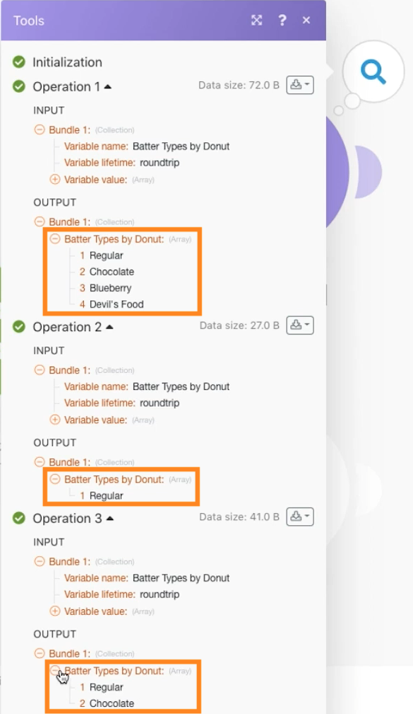
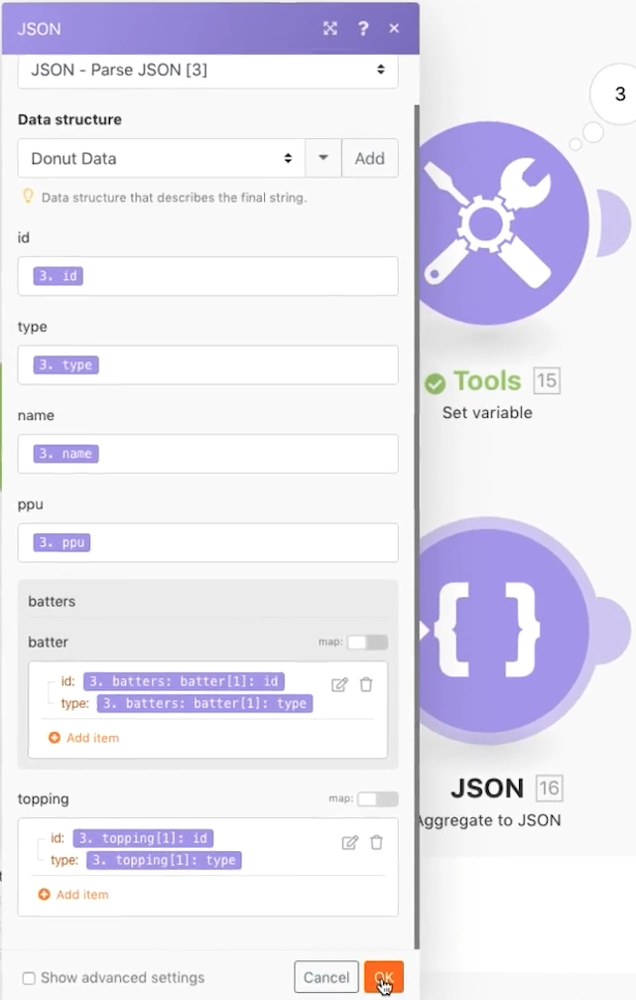

# 使用 JSON 练习

了解如何在场景中创建和解析 JSON，以支持设计需求。

## 练习概述

本练习的目的是从概念上展示如何利用以 JSON 格式发送到场景的信息，并将其解析为可在整个场景中映射的字段和项目。然后，您可以从这些映射数组中获取信息，也可以将信息聚合到 JSON 中，然后发送到另一个需要 JSON 作为接收输入的系统。

## 应遵循的步骤

**创建数据结构并解析 JSON。**

1. 创建一个新场景，并将其命名为“使用 JSON 甜甜圈数据”。
1. 对于触发器模块，使用“设置变量”模块。
1. 对于变量名称，输入“甜甜圈数据”。
1. 对于变量值，复制并粘贴测试版中 Fusion 练习文件文件夹中的 &quot;_Donut Data - Sample JSON.rtf&quot; 文档的内容。

   

1. 将此模块重命名为“来自另一个连接器的 JSON”。
1. 添加一个解析 JSON 模块。
1. 单击数据结构字段的“添加”。
1. 选择“生成器”并将复制的甜甜圈数据（样本 JSON 数据）粘贴到“样本数据”字段中。

   

1. 单击“保存”，将数据结构命名为“甜甜圈数据”。然后单击“保存”。
1. 将“甜甜圈数据”从“设置变量”模块映射到 JSON 字符串字段。

   

1. 保存您的场景，然后单击“运行一次”，以查看输出。

   **解析 JSON 模块的输出应如下所示：**

   

   **映射到特定的数组变量。**

1. 在解析 JSON 模块后面添加一个路由器。
1. 在顶部路径中，添加一个“设置变量”模块。
1. 对于“变量”名称，输入“按甜甜圈划分的面糊类型”。
1. 对于“变量”值，请使用映射函数从面糊数组中获取面糊类型。

   

1. 单击“确定”，然后单击“运行一次”。
1. 打开执行检查器以查看三个操作中每个操作的输出捆绑包，其中显示每个操作的面糊类型。

   

   **将场景数据聚合为 JSON。**

1. 在下部路由路径上，在 JSON 模块中添加一个聚合。
1. 对于“源”模块，选择迭代器——解析 JSON 模块。
1. 对于数据结构，创建或选择任何数据结构。对于本示例，请使用甜甜圈数据。
1. 继续直接映射本示例的字段，如下所示。
1. 当您开始处理面糊和配料时，请注意这些是数组，因此您需要单击“添加项目”来映射它们。

   

1. 保存该场景并单击“运行一次”。

查看“聚合至 JSON”模块的执行检查器，并注意如何能够将三个捆绑包聚合为单个 JSON 字符串。然后，您可以将此字符串发送到需要 JSON 的其他系统。

