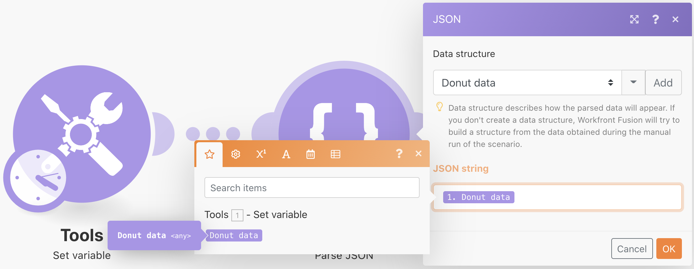

# 使用JSON

了解如何在场景中创建和解析JSON以满足您的设计需求。

## 练习概述

本练习的目的在于从概念上说明如何利用以JSON格式发送到方案的信息，将其解析为可在整个方案中映射的字段和项目。 然后，您可以从这些映射的数组中获取信息，或将信息聚合到JSON中，以便随后将其发送到另一个需要JSON作为接收输入的系统。

## 要遵循的步骤

**创建数据结构并解析JSON。**

1. 创建新方案，并将其命名为“使用JSON圆环数据”。
1. 对于触发器模块，使用设置变量模块。
1. 对于变量名称，键入“圆环数据”。
1. 对于变量值，请复制并粘贴在测试驱动器的Fusion Exercise Files文件夹中找到的“_Donut Data - Sample JSON.rtf”文档的内容。

   

1. 将此模块重命名为“从其他连接器中使用JSON”。
1. 添加解析JSON模块。
1. 单击“数据结构”字段的添加。
1. 选择生成器，并将您复制的Donut Data - Sample JSON数据粘贴到Sample Data字段中。

   

1. 单击保存，将数据结构命名为“圆环数据”。 然后，单击保存。
1. 将设置变量模块中的圆环图数据映射到JSON字符串字段。

   

1. 保存方案，然后单击运行一次以查看输出。

   **解析JSON模块的输出应如下所示：**

   

   **映射到特定数组变量。**

1. 在解析JSON模块后添加路由器。
1. 在顶部路径中，添加设置变量模块。
1. 对于变量名称，键入“按圆环键入面糊类型”。
1. 对于变量值，使用映射函数从批处理器数组获取批处理类型。

   

1. 单击“确定”，然后单击“运行一次”。
1. 打开执行检查器，以查看三个操作中每个操作的输出包，并显示每个操作的电池类型。

   

   **将方案数据聚合到JSON。**

1. 在较低的路由路径上，添加一个聚合到JSON模块。
1. 对于源模块，选择迭代器 — 解析JSON模块。
1. 对于数据结构，请创建或选择任何数据结构。 在本例中，使用圆环数据。
1. 继续并直接映射此示例中的字段，如下所示。
1. 当您开始打球和打顶球时，请注意这些是数组，因此您需要单击“添加”项目来映射它们。

   

1. 保存方案，然后单击运行一次。

查看聚合到JSON模块的执行检查器，并注意您如何能够将三个包聚合到单个JSON字符串中。 然后，您可以将此字符串发送到其他需要JSON的系统。

