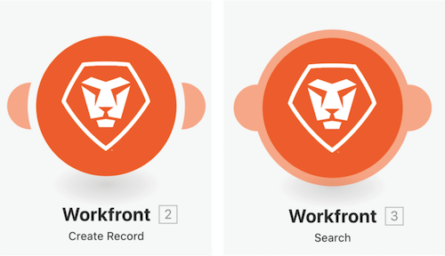

# 访问以前的版本演练

在此视频中，您将：

* 了解在对场景进行更改并多次保存后如何恢复以前的版本。

## 访问以前的版本演练

Workfront 建议先观看练习演练视频，然后再尝试在您自己的环境中重新创建练习。

>[!VIDEO](https://video.tv.adobe.com/v/3416533/?quality=12&learn=on&enablevpops&captions=chi_hans)

>[!NOTE]
>
>保存场景后，如果您将来需要访问它，三点菜单下会提供新版本。之前保存的场景版本只能保留 60 天。如果出于审核目的您需要在 60 天之后访问以前的版本，Workfront 建议保存场景 Blueprint 并在商定的位置存档。

## 添加到您的术语

### 触发器模块

触发器模块只能用作第一个模块，并且可以返回零个、一个或多个捆绑包。除非进行汇总，否则它们会在后续模块中单独处理。

**轮询触发器（触发器上显示有时钟）**——跟踪最后处理的记录的特殊功能。

**即时触发器（触发器上显示有闪电）**——根据 Webhook 立即触发。

### 操作和搜索模块

**操作**——用于执行 CRUD（创建、读取、更新和删除）操作

**搜索**——用于搜索零个、一个或多个记录，并将它们作为捆绑包返回，这些捆绑包将在后续模块中单独处理，除非聚合。

## 想要了解详情？我们建议查看以下内容：

[Workfront Fusion 文档](https://experienceleague.adobe.com/docs/workfront/using/adobe-workfront-fusion/workfront-fusion-2.html?lang=zh-Hans)
