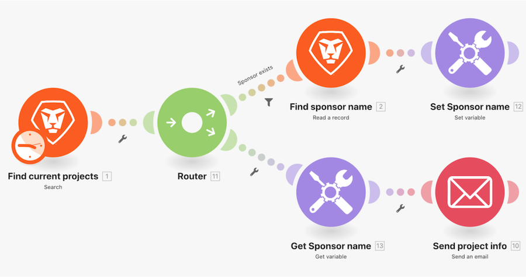

# 设置/获取变量演练

在Workfront中查找有关项目的信息，并发送包含相关信息的电子邮件。

## 获取/设置变量演练

Workfront建议先观看练习演练视频，然后再尝试在您自己的环境中重新创建练习。

>[!VIDEO](https://video.tv.adobe.com/v/335276/?quality=12&learn=on)

>[!TIP]
>
>有关完成演练的分步说明，请转到 [设置/获取变量演练](https://experienceleague.adobe.com/docs/workfront-learn/tutorials-workfront/fusion/exercises/set-get-variables.html?lang=en) 练习。

## 轮到你了

>[!NOTE]
>
>练习和挑战是可选的，不需要完成Fusion培训。

本练习基于您在演练中所学到的内容，但未提供解决方案。

克隆在此演练中创建的“路由路径间共享变量”方案。 通过电子邮件将您撰写的消息发送给项目所有者和项目发起人。 您还希望在消息中包含项目完成情况。 （目前，该条件可以显示为两个字母的键。）

**挑战：** 安排您的方案在每周的星期一上午8点发送此“电子邮件”。

## 想要了解更多信息？ 我们建议执行以下操作：

[Workfront Fusion文档](https://experienceleague.adobe.com/docs/workfront/using/adobe-workfront-fusion/workfront-fusion-2.html?lang=en)
