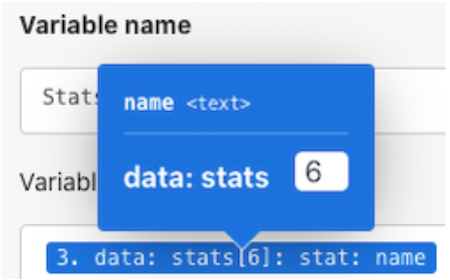

# 路由器演练

使用路由器将宠物小精灵与超级英雄捆绑包沿着正确的路径传递，然后为每个角色创建一个任务。

## 路由器演练

Workfront 建议先观看练习演练视频，然后再尝试在您自己的环境中重新创建练习。

>[!VIDEO](https://video.tv.adobe.com/v/335272/?quality=12&learn=on&enablevpops)

## 练习 URL

* 超级英雄 API 网站：`https://www.superheroapi.com/`
* 练习的第一个 URL：`https://www.superheroapi.com/api/{access-token}/{character-id}/appearance`
* 练习的第二个 URL：`https://www.superheroapi.com/api/{access-token}/{character-id}/powerstats`

如果您在访问自己的超级英雄令牌时遇到问题，可以使用此共享令牌：10110256647253588。请注意您调用超级英雄 API 的次数，以便其他人可以继续使用该共享令牌。

## 在映射面板中搜索项目

映射面板顶部的“搜索项目”字段可以帮助您快速查找面板中的字段，即使它们嵌套在数组中也是如此。搜索不区分大小写。

## 使用 API 的提示和技巧

到目前为止，您已经使用了一个非常简单的 API（应用程序编程接口），它不需要额外的身份验证即可提取场景中所需的信息。以下是一些可帮助您使用 API 和通用连接器的提示。

## 步骤 1：确定 API 的类型

Workfront 和许多软件系统都是使用 REST（表述性状态传输）API 构建的，这是当今最简单、最标准的 API 类型。但是，还有其他一些类型，例如：

* SOAP（简单对象访问协议）（Workfront 的校样 API 是以 SOAP 为基础的）
* FTP（文件传输协议）
* SFTP（安全文件传输协议）
* 要了解更多信息，请在网络上搜索 API 类型和感兴趣的关键词。

>[!NOTE]
>
>当连接到更大的平台（例如 Salesforce）时，这些平台的不同区域将提供不同的 API。确保为要连接的服务找到合适的选择。

## 步骤 2：确定 API 所需的身份验证类型

API 身份验证是一种身份验证形式，用于控制对服务的访问权限，例如当您尝试通过 Workfront Fusion 进行连接时的情况。它可以帮助您向另一个系统验证您有权访问该系统。OAuth 2 是当今最常用的身份验证类型。通过在互联网上进行搜索，了解有关 API 身份验证的更多信息。

身份验证可能是使用 API 时最困难的方面。Workfront Fusion 通用连接器最有价值的功能之一是，在使用基本身份验证等常见身份验证方法（例如 OAuth 2、API 密钥等）时，Workfront Fusion 可以为您处理身份验证。使用适合您的身份验证方法的 Workfront Fusion 模块（例如 OAuth 2）创建连接后，每次您想要运行场景时，Workfront Fusion 将会不断生成 API 密钥和/或令牌。

请参阅有关 Experience League 的增强型身份验证概述文章，了解 Workfront 提供的不同类型的身份验证。

## 步骤 3：阅读 API 文档并找到所需的端点

当 API 与另一个系统交互时，这种通信的接触点会被视为端点。端点是 API 发送请求和资源所在的位置。

使用通用连接器与 API 交互时，您需要了解 API 支持哪些端点以及每个请求需要哪些数据。API 文档应描述 API 的端点以及如何执行创建、读取、更新或删除等常见操作。执行这些调用需要一些练习，特别是如果您不熟悉进行 API 调用或使用新的 API 时更是如此。

了解更多关于 Workfront Fusion 通用连接器的信息，以及如何设置它们以与 Experience League 上所需的 API 连接。

## 最后说明

您可以在 Experience League 中查看我们预构建的应用程序连接器的完整列表。如果您想向 Workfront Fusion 产品团队推荐新的应用程序连接器，请将您的想法提交给 Innovation Lab。如果您之前没有提交过，请了解有关 Innovation Lab 的更多信息，以及如何为创意投票，并参与一年两次的排行版优先排序。如果您已经具有访问 Innovation lab 的权限，请登录并提交您的想法。

## 到您了

>[!NOTE]
>
>练习和挑战是可选的，并不是完成 Fusion 培训所必需的。

本练习以您在演练中学到的内容为基础，但未提供解决方案。

在为宠物小精灵角色“设置”多个变量模块中，创建一个名为“统计数据（级别）”的变量。将宠物小精灵“统计数据”的名称映射到此变量中。使用数组值功能更改数组的显示方式，以便每个“统计数据”都是一个新行，如下所示。

**提示：**&#x200B;只有六种不同的宠物小精灵“统计数据”具有相应的级别。

**挑战：**&#x200B;看看是否可以使用数组公式来获得以与上面相同的方式显示为不同行的“能力”，而不是用逗号分隔的一串值。下面的屏幕快照中有一个提示。

## 想要了解详情？我们建议查看以下内容：

[Workfront Fusion 文档](https://experienceleague.adobe.com/en/docs/workfront-fusion/using/get-started-with-fusion/understand-workfront-fusion/workfront-fusion-overview)
