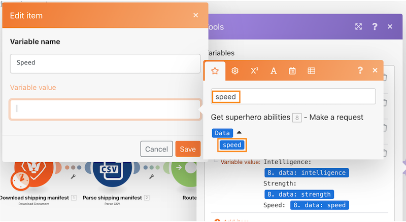

# 路由器演练

## 概述

使用路由器将“精灵宝可梦”与“超级英雄”捆绑包传递到正确的路径，然后为每个字符创建一个任务。

## 路由器演练

Workfront建议先观看练习演练视频，然后再尝试在您自己的环境中重新创建练习。

>[!VIDEO](https://video.tv.adobe.com/v/335272/?quality=12)

## 练习URL

* Superhero API网站： `https://www.superheroapi.com/`
* 练习的首个URL： `https://www.superheroapi.com/api/{access-token}/{character-id}/appearance`
* 练习的第二个URL： `https://www.superheroapi.com/api/{access-token}/{character-id}/powerstats`

如果您在访问自己的超级英雄令牌时遇到问题，可以使用此共享令牌：10110256647253588。 请注意您调用超级英雄API的次数，以便此共享令牌继续适用于每个人。

>[!TIP]
>
>有关完成演练的分步说明，请转到 [路由器演练](https://experienceleague.adobe.com/docs/workfront-learn/tutorials-workfront/fusion/exercises/routers.html?lang=en) 运动。

## 在映射面板中搜索项

映射面板顶部的搜索项字段可帮助您快速查找面板中的字段，即使这些字段嵌套在数组中也是如此。 搜索不区分大小写。

## 使用API的提示和技巧

到目前为止，您已经使用了一个非常简单的API（应用程序编程接口），它不需要额外的身份验证来提取场景中所需的信息。 以下提供了一些提示，可帮助您导航使用API和通用连接器。

## 步骤1：确定API的类型

Workfront和许多软件系统都是使用REST（代表性状态传输）API构建的，它是当今最简单且最标准的API类型。 但是，还有其他一些情况，例如：

* SOAP（简单对象访问协议）(Workfront的验证API基于SOAP)
* FTP（文件传输协议）
* SFTP（安全文件传输协议）
* 要了解更多信息，请在Web上搜索感兴趣的API类型和关键词。

>[!NOTE]
>
>当连接到更大的平台（如Salesforce）时，这些平台的不同区域将提供不同的API。 确保找到要连接的服务的正确服务器。

## 步骤2：确定API所需的身份验证类型

API身份验证是一种标识形式，用于控制对服务的访问，例如，当您尝试通过Workfront Fusion连接时。 它有助于向其他系统证明您有权访问系统。 OAuth 2是当今使用的最常见身份验证类型。 通过互联网搜索了解有关API身份验证的更多信息。

身份验证可能是使用API时最困难的方面。 Workfront Fusion通用连接器最有价值的功能之一是，在使用基本身份验证等常用身份验证方法（如OAuth 2、API密钥等）时，Workfront Fusion可以处理您的身份验证。 在使用适用于您的身份验证方法（例如，OAuth 2）的Workfront Fusion模块创建连接后，Workfront Fusion将在您每次想要运行场景时不断生成API密钥和/或令牌。

在有关Experience League的增强型身份验证概述文章中了解Workfront提供的不同类型的身份验证。

## 步骤3：阅读API文档并查找所需的端点

当API与另一个系统交互时，此通信的接触点被视为端点。 端点是API发送请求和资源所在的位置。

使用通用连接器与API交互时，您需要了解API支持哪些端点以及每个请求需要什么数据。 API文档应描述API的端点以及如何执行创建、读取、更新或删除等常见操作。 执行这些调用需要一些实践，尤其是当您不熟悉API调用或使用新API时。

详细了解Workfront Fusion Universal连接器，以及如何将其设置为与Experience League时所需的API连接。

## 最终注释

您可以在Experience League中查看我们预建的应用程序连接器的完整列表。 如果您想向Workfront Fusion产品团队建议新的应用程序连接器，请将您的想法提交给创新实验室。 如果您以前没有提交过，请进一步了解创新实验室，以及如何投票支持想法并参与每年两次的排行榜。 如果您已经拥有创新实验室的访问权限，请登录并提交您的想法。

## 轮到你了

>[!NOTE]
>
>练习和挑战是可选的，不是完成Fusion培训所必需的。

此练习练习基于您在演练中所学到的内容，但未提供解决方案。

在为“神奇宝贝”字符设置多个变量模块中，创建一个名为“Stat（级别）”的变量。 将“神奇宝贝统计”的名称映射到此变量。 使用数组值功能更改数组的显示方式，以便每个Stat都是一行新行，如下所示。

**提示：** 只有6个不同的《神奇宝贝》数据具有相应的水平。

**挑战：** 查看是否可以使用数组公式使功能以与上面相同的方式显示为不同的行，而不是显示为以逗号分隔的值字符串。 下面的屏幕快照中有一个提示。

## 想要了解更多信息？ 我们建议执行以下操作：

[Workfront Fusion文档](https://experienceleague.adobe.com/docs/workfront/using/adobe-workfront-fusion/workfront-fusion-2.html?lang=en)
