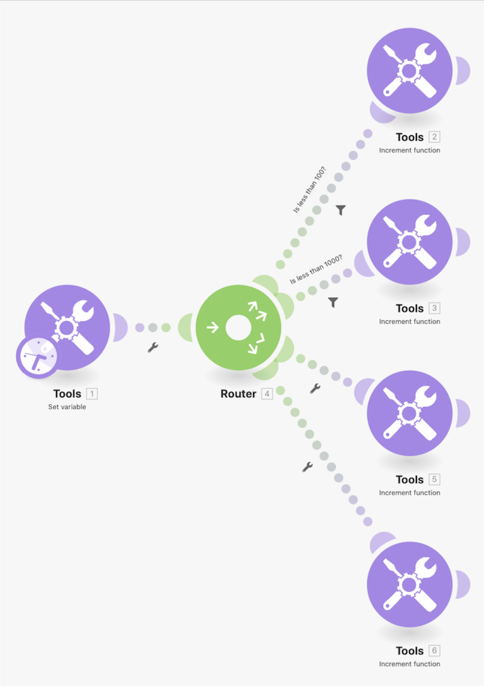

# 路由模式演练

使用“设置变量”模块，通过多个路径发送数字，以了解过滤器和回退项目在路由时的行为。

## 路由模式演练

Workfront 建议先观看练习演练视频，然后再尝试在您自己的环境中重新创建练习。

>[!VIDEO](https://video.tv.adobe.com/v/335274/?quality=12&learn=on&enablevpops=1)

## 想要了解详情？ 我们建议查看以下内容：

[Workfront Fusion 文档](https://experienceleague.adobe.com/zh-hans/docs/workfront-fusion/using/get-started-with-fusion/understand-workfront-fusion/workfront-fusion-overview)
