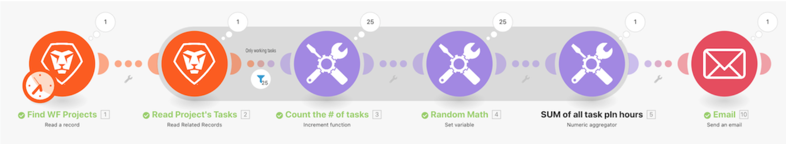

# 聚合演练

## 概述

使用您在最后一步中构建的“迭代简介”方案，汇总项目中每个工作任务的计划时间，并向您自己发送一封包含该信息的电子邮件。

## 聚合演练

Workfront建议先观看练习视频，然后再尝试在您自己的环境中重新创建练习。

>[!VIDEO](https://video.tv.adobe.com/v/335280/?quality=12)

>[!TIP]
>
>有关完成演练的分步说明，请转到 [聚合演练](https://experienceleague.adobe.com/docs/workfront-learn/tutorials-workfront/fusion/exercises/aggregation.html?lang=en) 练习。

## 想了解更多吗？ 我们建议执行以下操作：

[Workfront Fusion文档](https://experienceleague.adobe.com/docs/workfront/using/adobe-workfront-fusion/workfront-fusion-2.html?lang=en)
