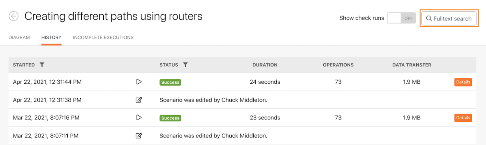

# 执行历史记录演练

查看“使用强大的过滤器”场景的执行历史记录，以了解执行时发生了什么，以及它们在运行时的结构。

## 执行历史记录演练

Workfront 建议先观看练习演练视频，然后再尝试在您自己的环境中重新创建练习。

>[!VIDEO](https://video.tv.adobe.com/v/335283/?quality=12&learn=on&enablevpops)

## 在历史选项卡中进行全文搜索

场景的历史记录选项卡中提供全文搜索，以便您搜索该场景中处理的任何数据。

全文搜索不是打开每个执行来搜索数据，而是在单个场景中的所有执行中进行搜索。搜索结果提供了找到数据的执行列表，您可以单击任何执行以进一步探索。

搜索结果包含一些有用的图标，如下图所示。

A——执行状态。

B—数据是否位于找到该数据的模块的输入或输出中。

C—执行 ID。

D—复制执行 ID。

当您单击某个执行时，Workfront Fusion 会加载该执行以及找到搜索结果的模块。它会在包含搜索数据的模块上打开执行检查器。

## 想要了解详情？我们建议查看以下内容：

[Workfront Fusion 文档](https://experienceleague.adobe.com/docs/workfront/using/adobe-workfront-fusion/workfront-fusion-2.html?lang=zh-Hans)
