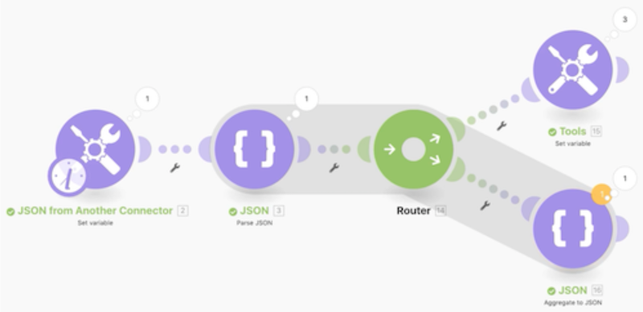

# 使用 JSON 演练

了解如何在场景中创建和解析 JSON，以支持设计需求。

## 数组演练

Workfront 建议先观看练习演练视频，然后再尝试在您自己的环境中重新创建练习。

在本视频中，您将学习如何：

* 在场景中创建和解析 JSON，以支持设计需求。

>[!VIDEO](https://video.tv.adobe.com/v/335301/?quality=12&learn=on&enablevpops=1)

## 想要了解详情？我们建议查看以下内容：

[Workfront Fusion 文档](https://experienceleague.adobe.com/en/docs/workfront-fusion/using/get-started-with-fusion/understand-workfront-fusion/workfront-fusion-overview)
