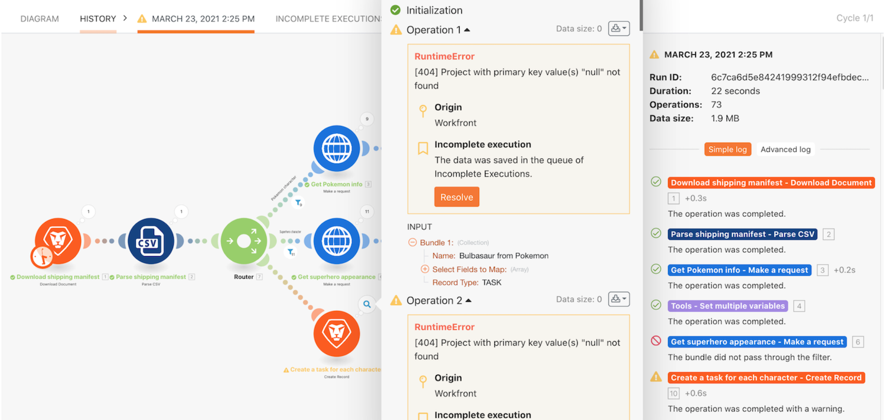

# 未完成的执行演练

学习存储未完成的执行的有用习惯，并了解在评估和更正错误后重新运行捆绑包时提供的价值。

## 未完成的执行演练

Workfront 建议先观看练习演练视频，然后再尝试在您自己的环境中重新创建练习。

>[!VIDEO](https://video.tv.adobe.com/v/3418177/?captions=chi_hans&quality=12&learn=on&enablevpops=1)

## 想要了解详情？ 我们建议查看以下内容：

[Workfront Fusion 文档](https://experienceleague.adobe.com/zh-hans/docs/workfront-fusion/using/get-started-with-fusion/understand-workfront-fusion/workfront-fusion-overview)
