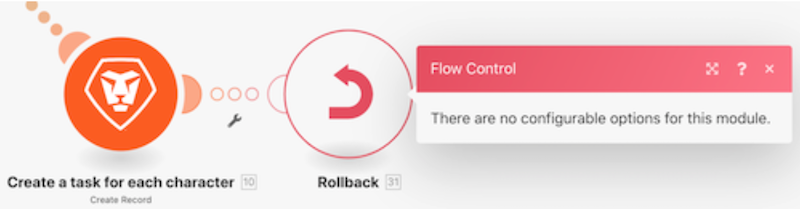

# 了解错误处理指令

在本视频中，您将了解到：

* 允许继续执行的三个错误处理程序指令
* 停止执行的两个错误处理程序指令

>[!VIDEO](https://video.tv.adobe.com/v/335305/?quality=12&learn=on)

## 指令——场景继续

### 恢复

* 指定替代输出并将其提供给遇到错误的模块。
* 处理后续模块。
* 场景执行状态标记为“成功”。

### 间断

* 场景执行的状态存储在未完成执行的队列中，在该队列中可以手动解决错误。然而，这里提到了一些例外情况。
* 未处理后续模块。
* 如果存在未处理的捆绑包，则场景执行会正常继续进行。
* 场景执行状态标记为“警告”。

### 忽略

* 该错误会被忽略，并且后续模块不会受到处理。
* 如果存在未处理的捆绑包，则场景执行会正常继续进行。
* 场景执行状态标记为“成功”。

## 指令——场景停止

### 回滚

* 场景执行立即停止，并在所有模块上启动回滚阶段，试图将它们全部恢复到初始状态。
* 未处理后续模块。
* 除少数错误类型外，在达到“场景”设置下指定的“连续错误数”之后，该场景将会被停用。
* 场景执行状态标记为“错误”。

>[!NOTE]
>
>如果没有将错误处理程序路由附加到该模块，并且未选中“场景”设置下的“允许存储未完成的执行”设置，则这是默认的行为。

### 提交

* 该错误会被忽略，并且后续模块不会受到处理。
* 如果存在未处理的捆绑包，则场景执行会正常继续进行。
* 场景执行状态标记为“成功”。

