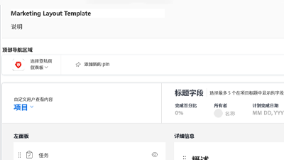
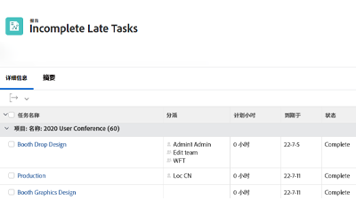

# WorkfrontTutorials {#overview}

培训视频和文章库，旨在帮助您更好地了解Workfront功能和设置。  其中包含最佳实践、策划的练习和其他资源，可帮助您和贵组织成功使用Workfront。

>[!VIDEO](https://video.tv.adobe.com/v/335063/?quality=12)

<!-- 

This is the landing page of the user guide. It should be the first list item in the TOC.md file. 
See other user landing pages to get ideas. 

-->

## What&#39;s New?

浏览每个Workfront产品版本的教程的最新更新。 以下是最新版本更新的内容：

* 收藏夹和收件人图标在Workfront的顶部导航中分开。 每个报表的简要摘要可在 <a href="/help/manage-work/projects/find-projects.md">查找项目</a> 教程。

* 配置自定义表单以处理多个对象类型。 请参阅 <a href="/help/custom-data/custom-forms/custom-forms-creating-and-sharing-a-custom-form.md">创建和共享自定义表单</a> 教程。

## 员工挑选

<table>
  <tr>
   <td>
      
      

         <a href="/help/administration-and-setup/layout-templates/find-layout-templates.md"><strong>查找和创建布局模板</strong></a>
<!----          <em>foo</em> --->
      

      

         
         了解如何创建基本布局模板。
      

    </td>
   <td>
      
      

         <a href="/help/manage-work/issues-requests/make-a-request.md"><strong>请求</strong></a>
<!----          <em>foo</em> --->
      

      

       
         了解如何发出、查看和编辑请求。
      

<td>
      
      

         <a href="/help/reporting/basic-reporting/create-a-simple-report.md"><strong>创建简单报表</strong></a>
<!----          <em>foo</em> --->
      

      

         
         了解如何创建简单的自定义报表。
      

    </td>
  </tr>
</table>
