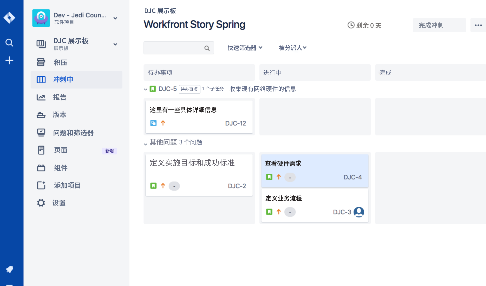
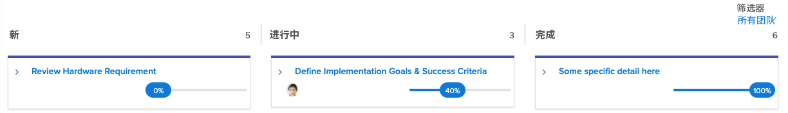

# 使用创建可见性 [!DNL Jira] 集成

[!DNL Jira]  是用于跟踪开发和技术支持团队的项目和问题的产品。 虽然许多团队使用Jira来跟踪任务级别的进度，但他们使用 [!DNL Workfront] 来进行真正的项目管理，因为他们可以获得高级进度视图。 使用 [!DNL Jira]  本机集成中，此信息可以在两个应用程序之间自动传输。

## 什么是 [!DNL Jira] ?

[!DNL Jira]  是创建的产品 [!DNL Atlassian] 跟踪开发和技术支持团队的项目和问题。 许多团队使用 [!DNL Jira]  跟踪任务级进度，但也使用 [!DNL Workfront] 来管理项目。 这意味着，团队可在 [!DNL Workfront] 和 [!DNL Jira] . 但是 [!DNL Jira]  本机集成，这种信息可以在两个应用程序之间自动传输。

## 什么是 [!DNL Jira]  集成需要？

这里我们有冲刺 [!DNL Workfront] 标题为[!DNL Workfront] 故事之春。”

捷迪开发理事会敏捷团队的负责人琼·哈里斯用这块磨花板和燃耗图来衡量整个短跑的进展。 它给团队提供了一个很好的视觉呈现。 此外，这些信息也被反馈到一个执行报告中，每个季度都会进行审查。 但是，团队中的大多数成员在 [!DNL Jira] ，否 [!DNL Workfront].

琼的团队一直在使用 [!DNL Jira]  多年来，一直以来，发现这是他们跟踪被指派处理的各个任务和/或错误的一种好方法。 但琼真的需要这些信息 [!DNL Workfront] 最终，还要为这些高管报告提供信息。

通过 [!DNL Jira]  本机集成、对任务、文章或错误所做的任何更新都可以自动更新中的任务、文章和/或问题 [!DNL Workfront].

因此，当分配给审核硬件要求文章的团队成员对 [!DNL Jira] ，则将其从“新”移至“进行中”时，该更新将自动更改中文章的状态 [!DNL Workfront] 也是。

