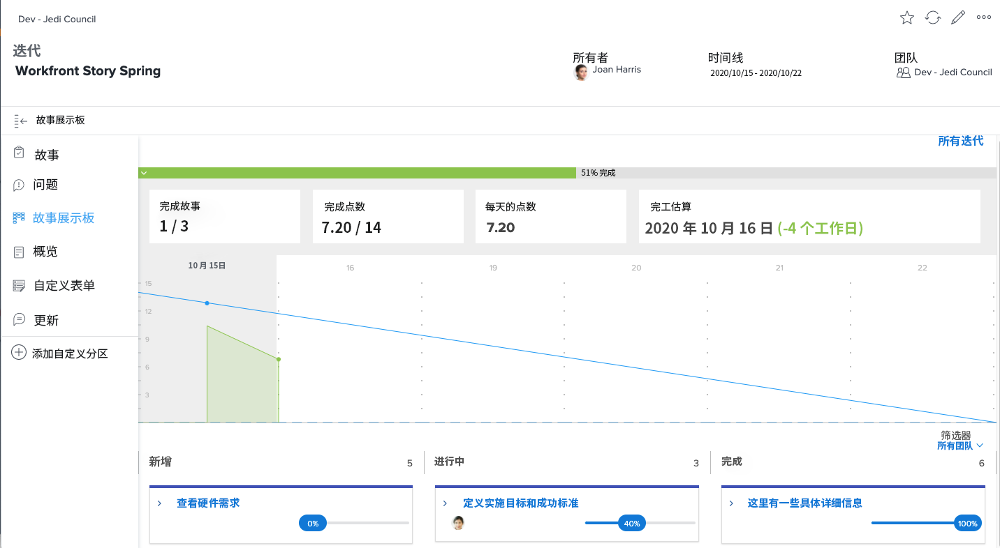

# 使用创建可见性 [!DNL Jira] 集成

[!DNL Jira]  是用于跟踪开发和技术支持团队的项目和问题的产品。 虽然许多团队使用Jira来跟踪任务级别的进度，但他们使用 [!DNL Workfront] 进行真正的项目管理，因为他们可以获得一个高层次的进度视图。 使用 [!DNL Jira]  本机集成，此信息可在两个应用程序之间自动传输。

## 什么是 [!DNL Jira] ？

[!DNL Jira]  是由创建的产品 [!DNL Atlassian] 为开发和技术支持团队跟踪项目和问题。 许多团队都使用 [!DNL Jira]  跟踪任务级别的进度，但它们也使用 [!DNL Workfront] 以管理项目。 这意味着团队要加倍努力，在中创建任务 [!DNL Workfront] 和 [!DNL Jira] . 但使用 [!DNL Jira]  原生集成，此类信息可以在两个应用程序之间自动传输。

## 如何安装适用于Jira的Adobe Workfront？

转到 [适用于Jira的Adobe Workfront](https://experienceleague.adobe.com/docs/workfront/using/adobe-workfront-integrations/workfront-for-jira/workfront-for-jira.html?lang=en) 了解如何安装和配置Adobe Workfront for Jira。

## 什么可以 [!DNL Jira]  集成do？

这里有冲刺 [!DNL Workfront] 标题为&#39;&#39;[!DNL Workfront] 故事之春。”

Dev-Jedi Council Agile团队负责人Joan Harris使用Scrum板和燃尽图作为衡量整体冲刺进度的方法。 它给团队提供了对正在发生事情的良好视觉呈现。 此外，这一信息还被纳入每季度审查一次的执行报告。 但是，团队中的大多数人都在以下位置进行了更新： [!DNL Jira] ，不是 [!DNL Workfront].

琼的团队一直在用 [!DNL Jira]  数年来，一直发现这是他们跟踪各个任务和/或他们被分派处理的错误的好方法。 但琼真的需要这些信息来连接 [!DNL Workfront] 最后，为高管报告提供素材。

通过 [!DNL Jira]  本机集成，对任务、故事或错误所做的任何更新都可以自动更新中的任务、故事和/或问题 [!DNL Workfront].

因此，当分配给“审核硬件要求”故事的团队成员更新中的状态时 [!DNL Jira] ，将其从“新”移动到“进行中”，该更新将自动更改文章的状态 [!DNL Workfront] 也是。

