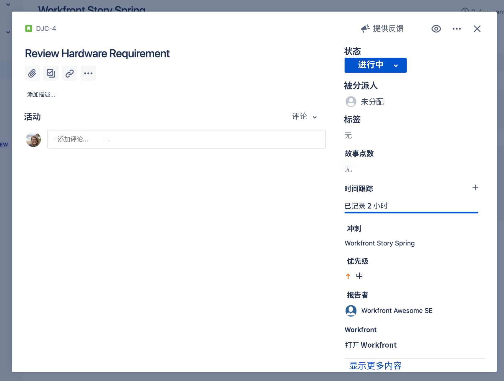

# 通过与 [!DNL Jira] 集成创建可见性

[!DNL Jira] 是一款开发和技术支持团队用来跟踪项目和问题的产品。虽然许多团队使用 Jira 来跟踪任务级别进度，但他们使用 [!DNL Workfront] 来进行真正的项目管理，因为他们可以由此获得高级进度视图。有了 [!DNL Jira] 原生集成，这些信息便可以在两个应用程序之间自动传输。

## 什么是 [!DNL Jira]？

[!DNL Jira] 是一款由 [!DNL Atlassian] 创建的适用于开发和技术支持团队跟踪项目和问题的产品。很多团队都使用 [!DNL Jira] 来跟踪任务级别的进度，但他们也会使用 [!DNL Workfront] 来管理项目。这意味着团队同时在 [!DNL Workfront] 和 [!DNL Jira] 中创建任务时需要做双倍的工作。而有了 [!DNL Jira] 原生集成，此类信息便可以在两个应用程序之间自动传输。

## 如何安装 Adobe Workfront for Jira？

访问 [Adobe Workfront for Jira](https://experienceleague.adobe.com/docs/workfront/using/adobe-workfront-integrations/workfront-for-jira/workfront-for-jira.html?lang=zh-Hans)，了解如何安装和配置 Adobe Workfront for Jira。

## [!DNL Jira] 集成有什么作用？

在这里，我们在 [!DNL Workfront] 中有一个名为“[!DNL Workfront] Story Spring”的冲刺。

Dev-Jedi Council 敏捷团队负责人 Joan Harris 使用 Scrum 展示板和燃尽图来衡量整个冲刺的进度。它有助于团队清晰地了解当前的情况。此外，这些信息还会纳入每季度审查一次的执行报告中。然而，大多数团队都会在 [!DNL Jira] 中进行更新，而不是在 [!DNL Workfront] 中。

Joan 的团队多年来一直在使用 [!DNL Jira]，他们发现这是跟踪分配给他们处理的个人任务和/或错误的好方法。但 Joan 非常需要将这些信息与 [!DNL Workfront] 相连，并最终为这些执行报告提供信息。

通过 [!DNL Jira] 原生集成，对任务、故事或错误所做的任何更新都可以自动更新 [!DNL Workfront] 中的任务、故事和/或问题。

因此，当被分配到“审查硬件需求”故事的团队成员更新 [!DNL Jira] 中的状态，将其从“新建”移动到“正在进行中”时，该更新也将自动更改 [!DNL Workfront] 中故事的状态。

