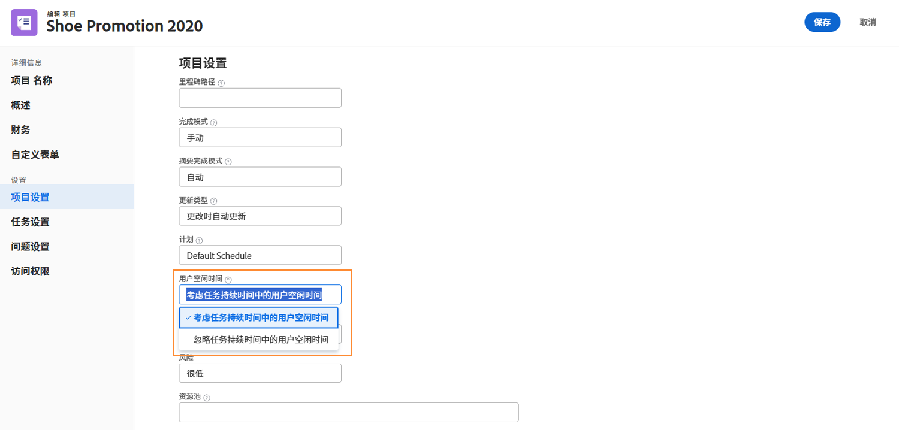
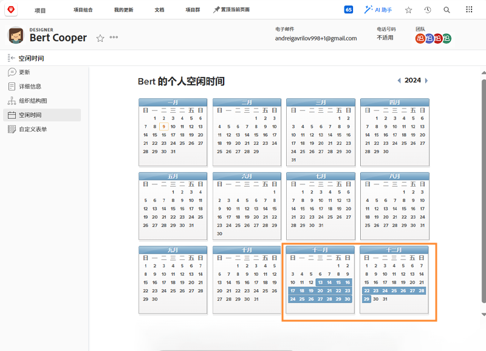
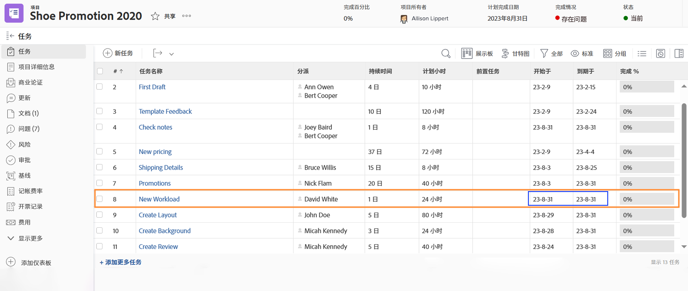
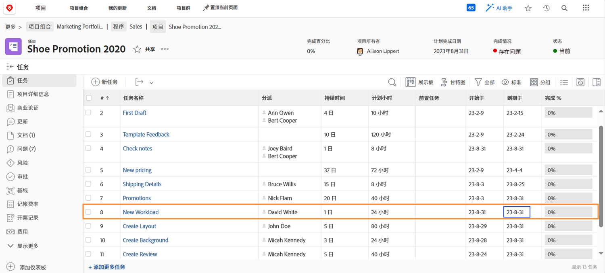
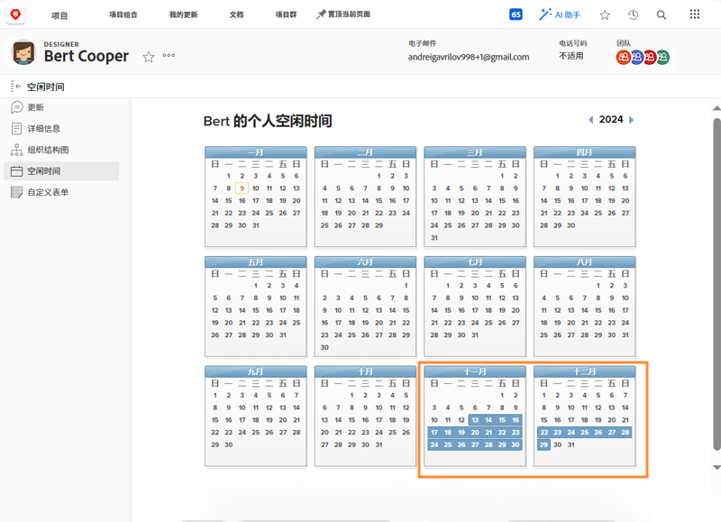
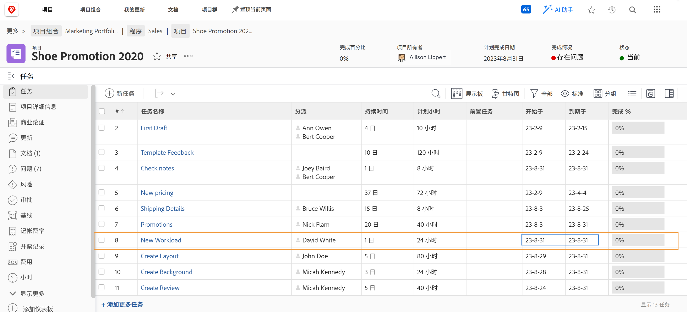
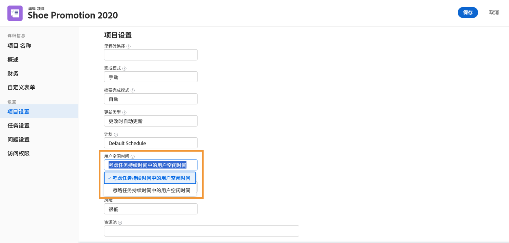

# 休息时间如何影响项目时间线

已分配用户的休息时间是否计入项目时间线取决于名为 [!UICONTROL User Time Off] 的项目设置。此设置决定了项目中该任务的规划日期是否会随着该任务的主要受让人的休息时间而调整。

让我们来看一看选择每种设置后项目时间线会发生什么 - C[!UICONTROL onsider user time off in task durations] 或者 [!UICONTROL Ignore user time off in task durations]。

## 在任务持续时间中考虑用户休息时间

此选项是 Workfront 的默认设置。

在此示例中，该任务的主要受让人在其个人日程表上标记有休息日。

项目经理希望分配给此人一项规划日期与用户休息时间重叠的任务。

当将该任务分配给此用户时，规划日期会自动调整。现在，为了考虑到用户的休息时间，该任务的规划完成日期延长了几天。请务必注意，此更改可能会影响项目中其他任务的计划日期，并可能会影响到项目的规划完成日期。

## [!UICONTROL Ignore user time off in task durations]

使用此选项后，任务的规划日期会按原计划保留，即使主要受让人在该任务的持续期间内休假也是如此。

团队成员在其日程表上标记有休息日。

项目经理给他们分配了一项与休息时间重叠的任务。分配用户后，该任务的规划日期将会按照原规划保留。

为了确保工作按时完成，建议在原受让人不在办公室时指派另一位可以处理该任务的人。

## 调整项目级别的设置

要更改某个项目中的用户休息时间设置：

* 通过在 Workfront 中单击项目名称来打开项目。

* 页面标题中项目名称右侧的三点菜单中选择 [!UICONTROL Edit]。

* 滚动到 [!UICONTROL Project Settings] 部分并找到 [!UICONTROL User Time Off] 字段。

* 选择您想要应用于此项目的选项 - [!UICONTROL Consider user time off in task durations] 或 I[!UICONTROL gnore user time off in task durations]。

* 单击窗口右上角的 [!UICONTROL Save] 按钮。

**注释**：在项目页面的左侧面板菜单中选择 [!UICONTROL Project Details] 时，此设置不可用。

[!UICONTROL Setup] 菜单的项目首选项中具有对此项的全局设置。此设置由您的系统管理员管理。组管理员也许可以为其管理的组调整此设置。

Workfront 建议按照您希望组织内的大多数项目处理休息时间的方式来对其进行设置。

该设置还可以通过模板详细信息内置到项目模板中。
