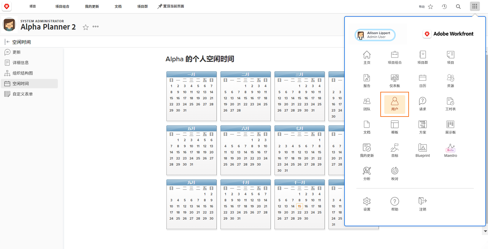

# 管理其他用户的休息时间

如果经理或其他领导者拥有通过其 Workfront 访问级别分配的“编辑用户”权限，则他们可以管理其团队成员的休息时间日程表。访问级别由 Workfront 系统管理员创建和分配。

Workfront 建议您的组织针对经理何时更新员工的个人休息时间日程表制定相关的政策或程序。

要管理其他用户的日程表：

* 单击 [!UICONTROL Main Menu] 并选择用户。

* 使用搜索图标查找用户或滚动列表。

* 单击列表中该用户的名称。

* 单击用户配置文件页面左侧面板菜单中的 [!UICONTROL Time Off]。

* 单击日程表上的日期。

* Workfront 假设全天休息时间。如果是这种情况，请继续并单击 [!UICONTROL Save] 按钮。

* 对于连续多个休息时间日，请将“截止日期”更改为休息时间的最后一天。单击 [!UICONTROL Save] 按钮。

* 如果标记了非全天休息时间日，请取消选中 [!UICONTROL All Day] 框。然后指出用户当天的工作小时数（他们有空的时间）。单击 [!UICONTROL Save] 按钮。
