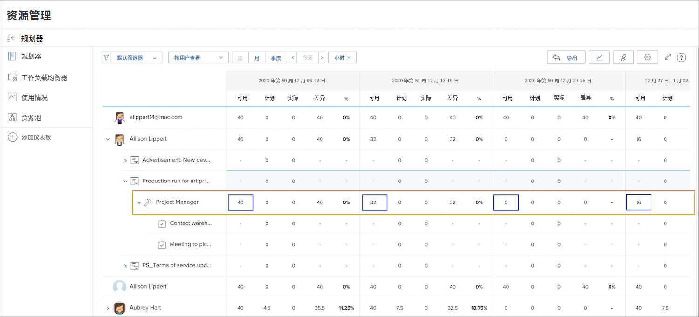
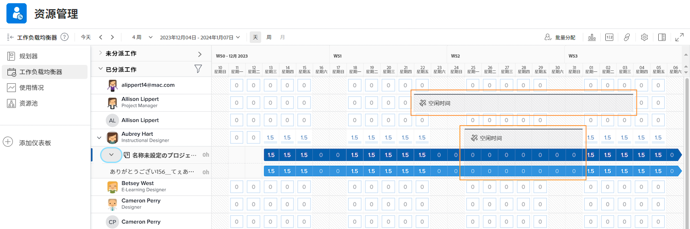

# 资源管理工具的可见性

了解谁可用以及何时可用对于资源规划和管理至关重要。 当用户在Workfront的日历中将个人休息时间标记为休息时，也可以在Workfront的资源工具中看到该信息。

## 资源规划者

用户的休息时间反映在资源规划者的“可用(AVL)”列中。 Workfront会根据分配的时间表、工作角色百分比等，将Workfront计算出的可用时间减去日历上标记的空闲时间。

## 工作负载均衡器

在工作负载均衡器中，休息时间以灰色条的形式显示在日历上。 此可见性可帮助资源经理和其他人在分配工作时做出更明智的决策。

但是，休息时间指示器不会阻止通过工作负载均衡器将工作分配给用户。 如果分配了工作，工作负载均衡器显示人员在工作时间期间被过度分配。

