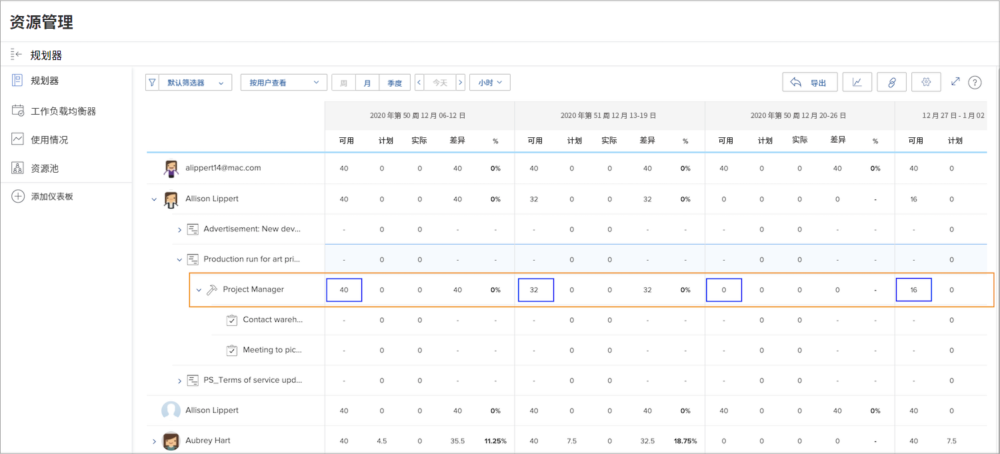
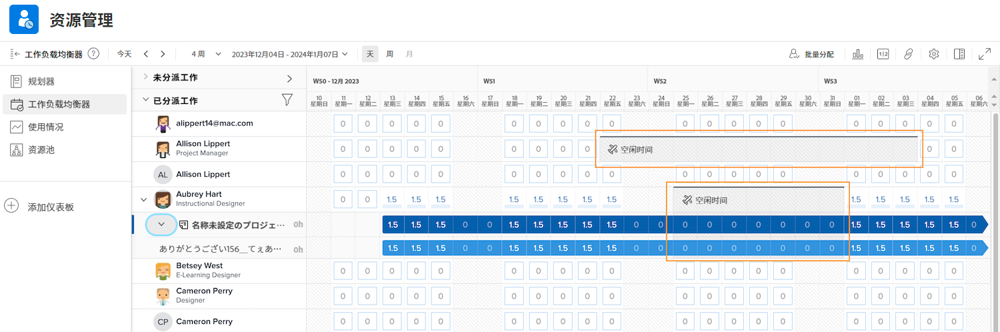

# 资源管理工具的可见性

了解谁在何时有空对于资源规划和管理至关重要。 当用户在 Workfront 的日程表中标记他们的个人休息时间时，该信息也可以在 Workfront 的资源工具中看到。

## 资源规划程序

用户的休息时间会在资源规划程序的“可用”(AVL) 列中显示。 Workfront 会从可用时间中减去日程表上标记的休息时间，由 Workfront 根据分配的计划、职位百分比等进行计算。

## 工作负载均衡器

在工作负载均衡器中，休息时间在日程表上显示为灰色条。 这种可见性有助于资源管理者和其他人在分配工作时作出更明智的决策。

但是，休息时间指标不会阻止通过工作负载均衡器将工作分配给用户。 如果分配了工作，工作负载均衡器会显示该人员在休息时间内分配了过多任务。

