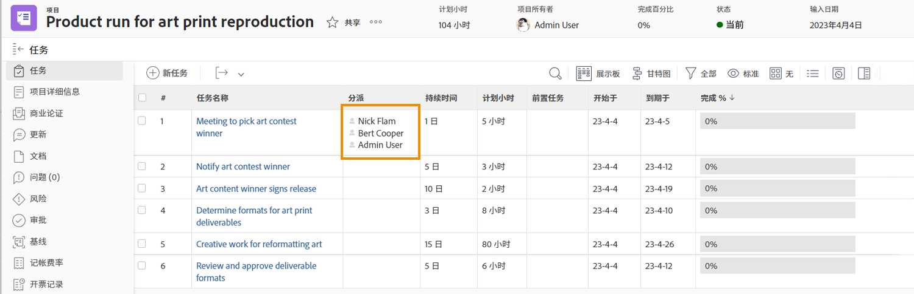
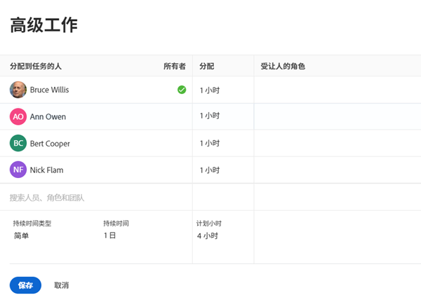
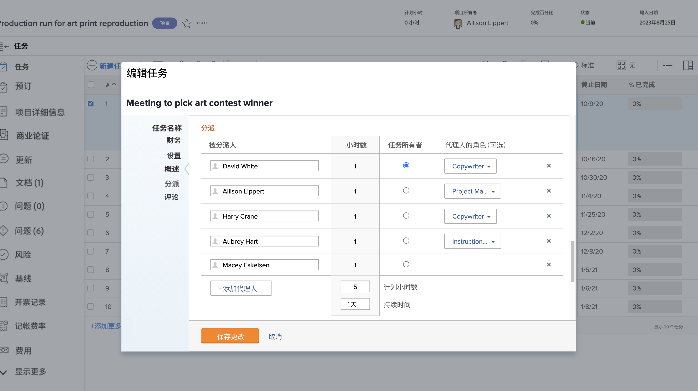

# 什么是主要代理人？

将两个或更多用户分配给任务时，主代理人存在。 主被分派人的日历时间是Workfront在应用“用户关闭时间”设置时要查看的内容。

从项目页面中了解主要被分派人。 单击“工作总揽”(Assignments)字段，然后单击角中的高级工作总揽图标。

在“高级分配”窗口中，主要任务分配或任务责任人将被指定为绿色复选标记。 将鼠标悬停在其他用户上，然后单击“设为主要”链接以更改任务所有者。

您还可以从任务页中调整主代理人。 选中项目列表中任务的框，然后单击编辑图标。 滚动到“工作总揽”部分，然后单击按钮以指定任务所有者。

