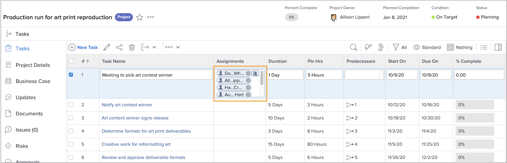
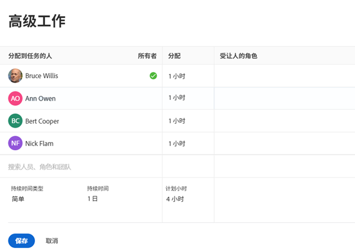
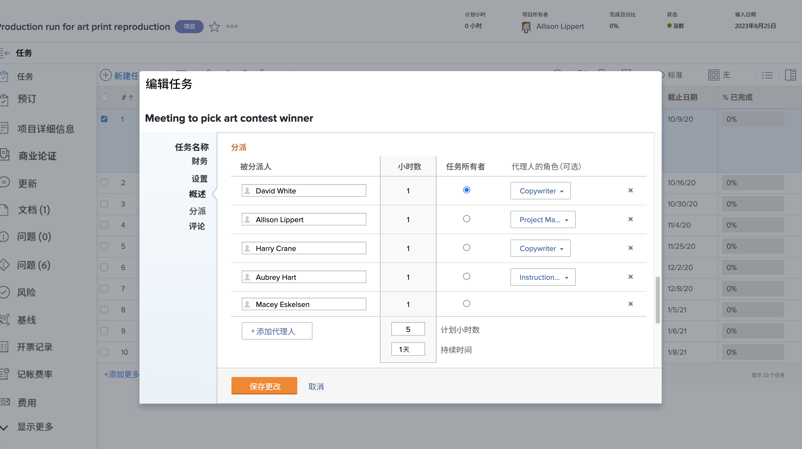

# 什么是主要受让人？

当两个或多个用户被分配到一项任务时，就会出现主要受让人。 Workfront 在应用用户休息时间设置时会查看主要受让人的休息时间日程表。

从项目页面找出主要受让人。 单击进入“任务”字段，然后单击角落中的高级任务图标。

在“高级任务”窗口中，主要受让人或任务所有者会用绿色复选标记指定。 将鼠标悬停在另一个用户上，然后单击“设为主要”链接以更改任务所有者。

您还可以在任务页面中调整主要受让人。 选中项目列表中相关任务的复选框，然后单击“编辑”图标。 滚动到“任务”部分，然后单击按钮指定任务所有者。

