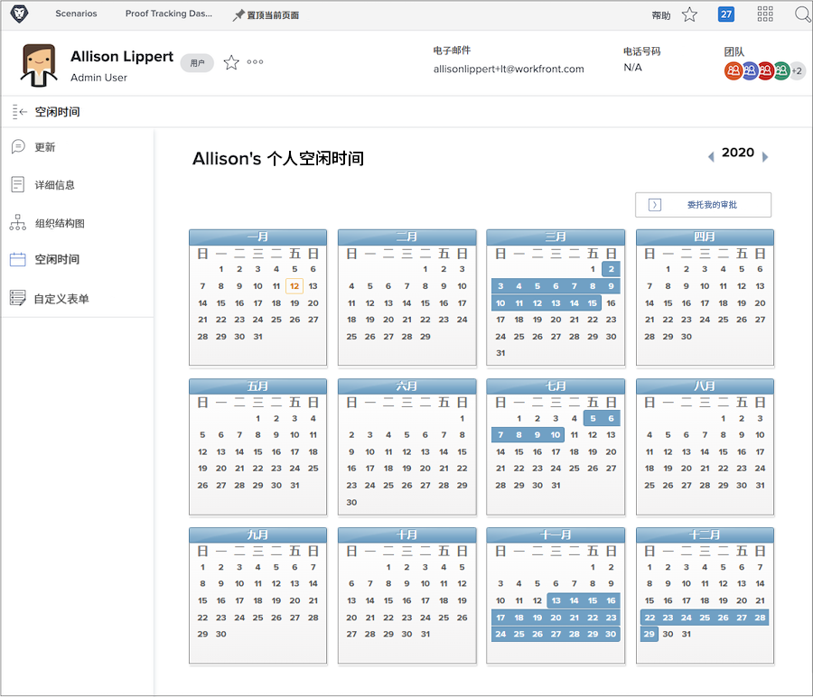
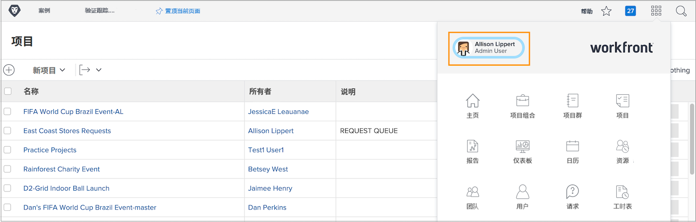
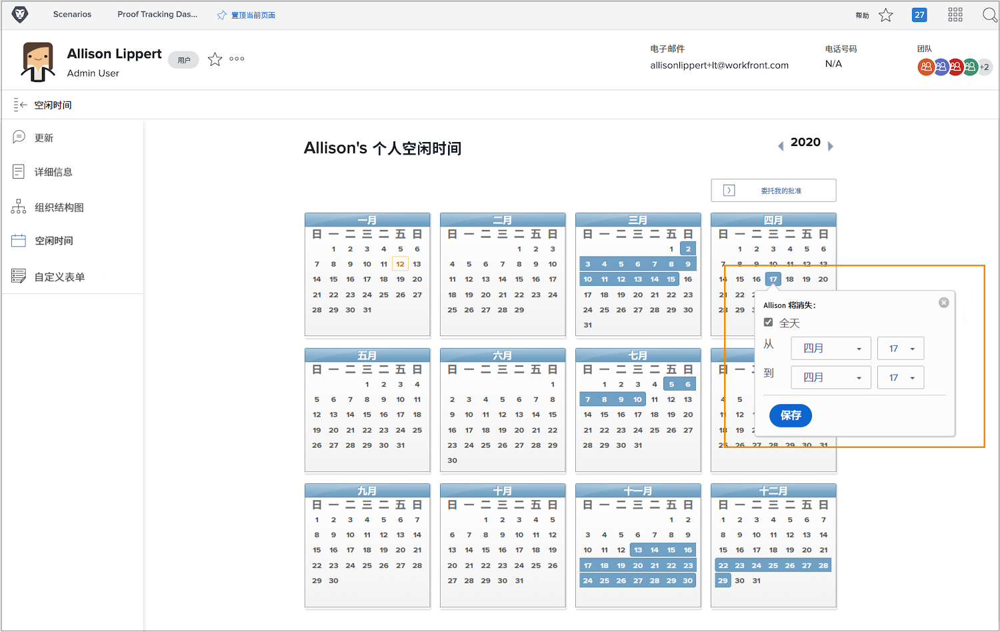

# 为什么要使用休息时间日程表？

当规划人员和项目经理在 Workfront 中分配任务时，了解哪些团队成员有时间完成分配的工作有助于按时完成项目。

当资源管理者在 Workfront 的资源规划和管理工具中审查任务分配情况时，准确的可用性数据也会影响当前和未来的工作规划。

Workfront 工作和规划许可证用户可以使用个人休息时间日程表来表示他们在常规的工作时间内何时无法工作。即使休息半天，也会影响分配给他们的任务的完成情况。

**注释**：Workfront 并非旨在复制或替换组织用于管理、累积或跟踪个人休息时间的现有系统。请遵循您所在组织有关请求和管理休息时间的指南。

## 标记您的休息时间

您的个人休息时间日程表位于 Workfront 的用户页面上，可从主菜单访问。单击左角您的名字。

* 单击 Workfront 用户页面左侧面板菜单中的“休息时间”。

* 默认情况下会显示当前年份。如果需要，请使用箭头选择不同的年份（位于日程表窗口的右上角）。

* 单击日程表上的日期。

* Workfront 会假设您要休息一整天。如果是这种情况，请继续并单击“保存”按钮。

* 如果您连续全天休息时间，请将截止日期更改为您休息时间的最后一天。单击“保存”按钮。

* 如果您不打算请一整天假，请取消选中“全天”框。然后标明您当天的工作时间（您工作的时间）。单击“保存”按钮。

您的休息时间在日程表上以蓝色框表示。该休息时间也会出现在 Workfront 的其他地方，以协助项目和资源规划。

**专家提示**：如果某项任务已分配给您，之后您在日程表上标记休息时间，在这种情况下，系统不会向项目经理发送通知让他们知道您无法工作。请务必向项目经理通报任何可能影响当前项目或分配给您的工作的新休息时间。
