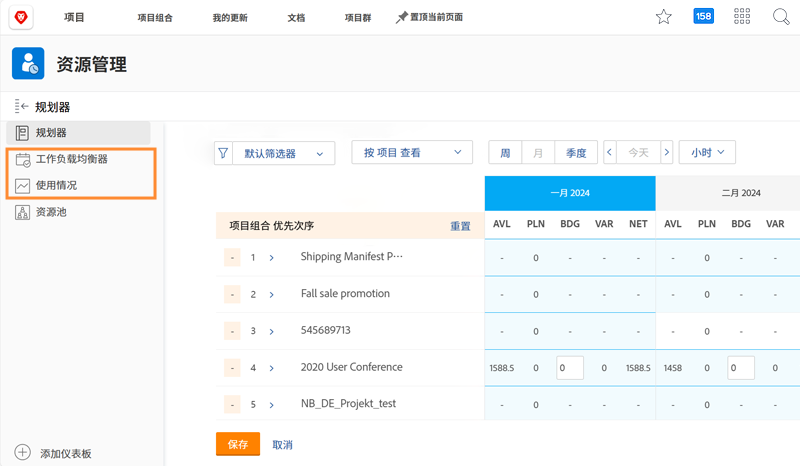

# 资源管理设置、工作负载平衡器和利用率报告

[!DNL Workfront] 跨 [!DNL Workfront] 中的多个工具提供数据，帮助您更轻松地作出资源决策，并使您的流程更加顺畅。要了解资源的使用情况，您应该确保您的管理者、用户和项目配置正确。即使您不打算使用所有 [!DNL Workfront's] 资源管理工具，这些配置也很有用。

在本节中，您将学习：

* 如何为资源管理者设置正确的访问权限
* 如何查看工作负载均衡器和利用率报告

## 资源管理设置

首先，我们要确保合适的人员能够访问并管理您组织的资源。

&lt;!下载分步说明指南。&gt;

## 工作负载均衡器和利用率报告

除了资源规划程序和资源池之外，如果访问级别中获得编辑权限，用户还可以访问其他工具，例如工作负载均衡器和利用率报告。

通过这些工具访问或管理资源不需要其他设置。

