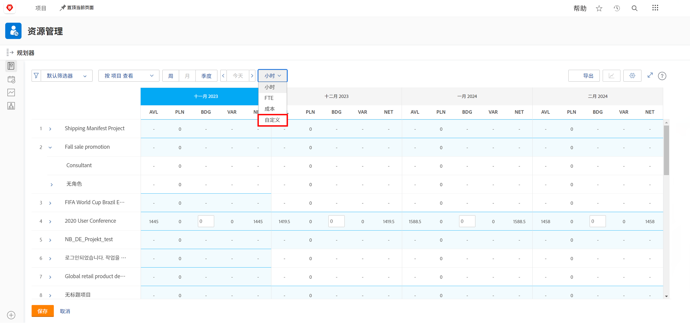
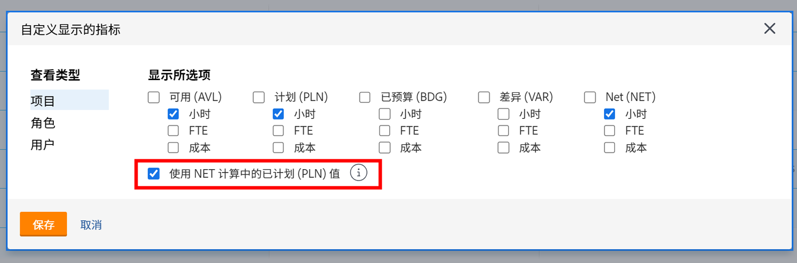
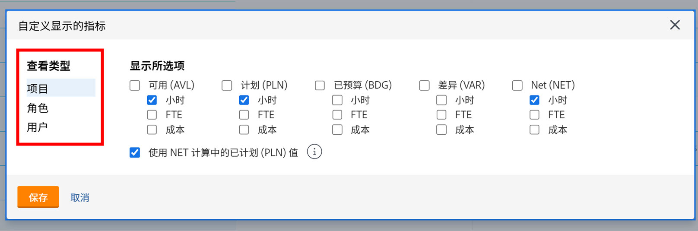
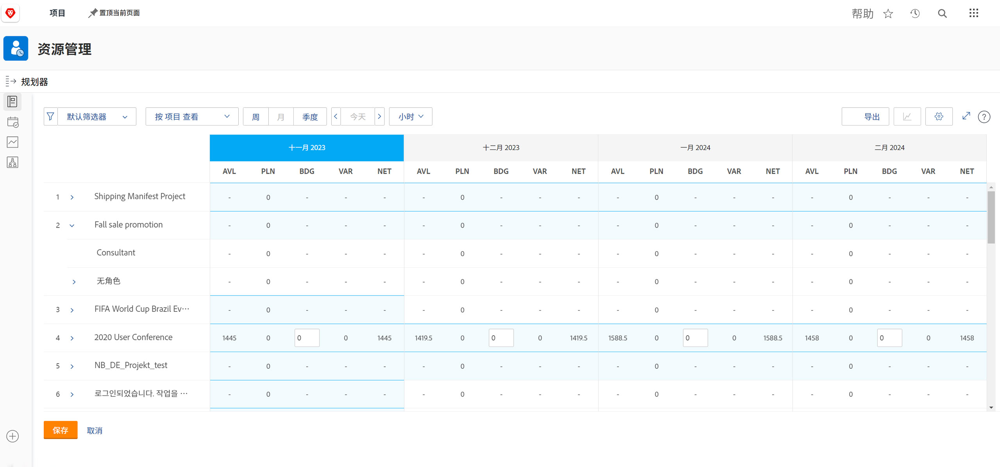

# 在中按作业角色查看 [!DNL Resource Planner]

在此视频中，您将：

* 请参阅 [!UICONTROL View by Job Role ]视图
* 了解资源信息在此视图中的显示方式

>[!VIDEO](https://video.tv.adobe.com/v/335169/?quality=12&learn=on)

对于“按职务角色查看”选项，默认显示“预算”列，该列从业务案例中提取项目所需的估计资源数（如果已填写）。 这也意味着在默认情况下，“网络”列会使用“预算”列中的数字来告诉您剩余的资源数量。

但是，您的组织可能没有使用或准备使用业务案例来估算这些金额。 您而是使用已在项目中输入的计划小时数。 通过自定义选项，您可以选择在所选视图中显示哪些列以及您希望如何计算Net列。

要更改显示的列和Net列计算，使其基于计划小时数：

* 单击“小时”下拉菜单，然后选择“自定义”。

* 在“自定义显示的量度”框中，确定显示哪些列，并选中在NET计算中使用计划值(PLN)值旁边的框。

**注意**:您可以通过选择框左侧的选项，在资源计划器中编辑不同视图类型的列和计算。

* 单击“保存”后，框将关闭，屏幕将刷新。

资源计划器显示您需要了解的有关供应和需求的信息，而无需复杂的电子表格和循环通信。

利用现有信息和您指挥的工具，您可以优化团队执行对您而言非常重要的工作的能力。
