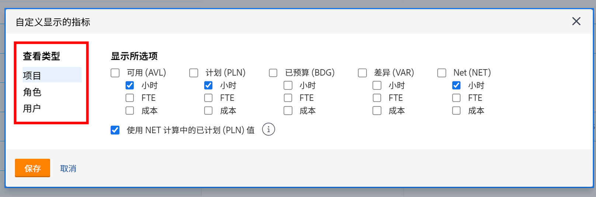

# 在中按项目查看 [!DNL Resource Planner]

在本视频中，您将执行以下操作：

* 参见 [!UICONTROL View by Project ]视图
* 了解此视图中如何显示资源信息

>[!VIDEO](https://video.tv.adobe.com/v/335170/?quality=12)

对于按项目查看选项，默认显示预算列，该列从业务案例中提取项目所需的估计资源数（如果已填写）。 这也意味着默认情况下，“网络”列将使用预算列中的数字来告诉您还剩下多少资源。

但是，贵组织可能没有使用或准备使用商业案例来估算这些金额。 而是使用已在项目上输入的计划小时数。 通过“定制”选项，可选择在所选视图中显示的列以及希望如何计算“网络”列。

要更改显示的列和净列计算，使其基于计划小时数，请执行以下操作：

* 单击小时数下拉菜单，然后选择自定义。

* 在自定义显示的指标框中，确定显示的列，并选中在NET计算中使用计划(PLN)值旁边的框。

**注释**：通过选择框左侧的选项，您可以在资源规划程序中编辑不同视图类型的列和计算。

* 单击“保存”后，该框将关闭，屏幕将刷新。

资源计划员显示您需要了解的供求信息，而无需复杂的电子表格和循环通信。

利用现有的信息和命令中的工具，您可以调整团队执行对您而言重要的工作的能力。
