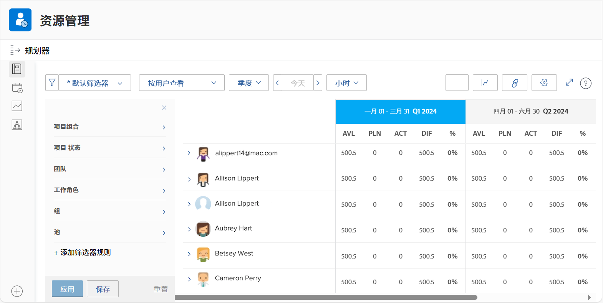

# 查看使用情况并筛选资源计划器

借助资源计划器，您可以清楚地了解您感兴趣的项目，并实时了解员工如何堆放以执行这些项目。

* 例如，您希望了解当最新的服务器更新方案成为您的最高优先级时，容量会发生什么情况。

* 资源计划器显示您人员的可用性以及将资源分配给一个项目将如何影响优先级较低的项目的可用性。

您将不仅能够了解资源分配对今天工作有何影响，而且当您超越当前资源计划需求时，还可以评估较长期的资源分配，以了解个人是否被分配过（或过）。

## 筛选资源计划员

资源计划器自动打开，并显示一组默认的过滤器。 您需要通过以下方式编辑这些过滤器：

* 时间范围
* Portfolio/计划
* 资源池等

这样，您就可以重点了解哪些资源可用以及何时可用。
