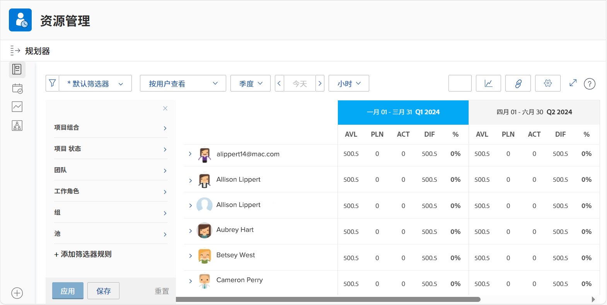

# 查看利用率情况并过滤资源规划程序

借助资源规划程序，您可以清楚地了解您感兴趣的项目，并实时了解您的员工队伍如何执行这些项目。

* 例如，您想知道当最新的服务器更新计划成为您的首要任务时，产能会发生什么变化。

* 资源规划程序会显示您的人员的可用性，以及将资源分配给一个项目会如何影响对拥有较低优先级项目的可用性。

您不仅能够看到资源分配如何影响今天的工作，而且当您考虑当前的资源计划需求以外的情况时，您可以评估长期资源分配，以了解个人是否分配了过多（或过少）的工作。

## 过滤资源规划程序

资源规划程序会自动打开，并带有一组默认的过滤器。 您将需要通过以下方式编辑这些过滤器：

* 时间范围
* 项目组合/项目群
* 资源池等

这使您可以专注于哪些资源可用以及何时可用。
