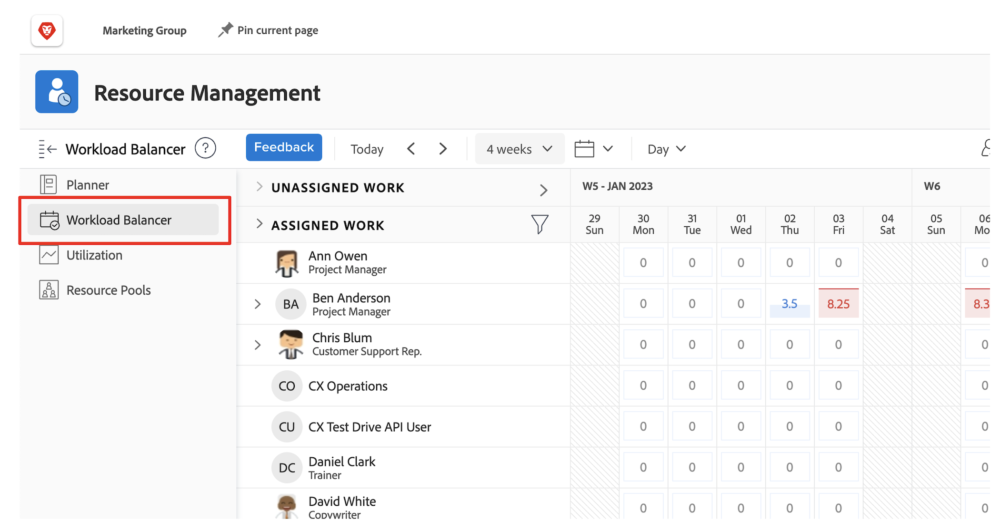
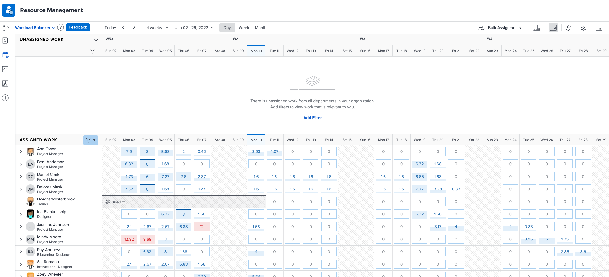
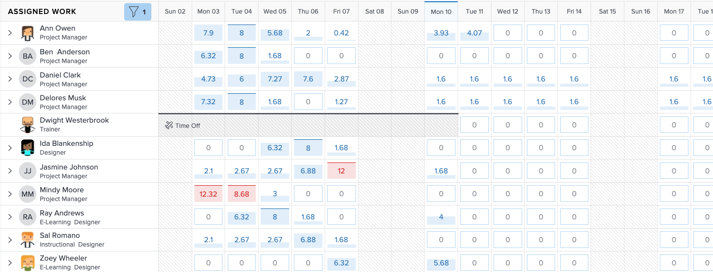
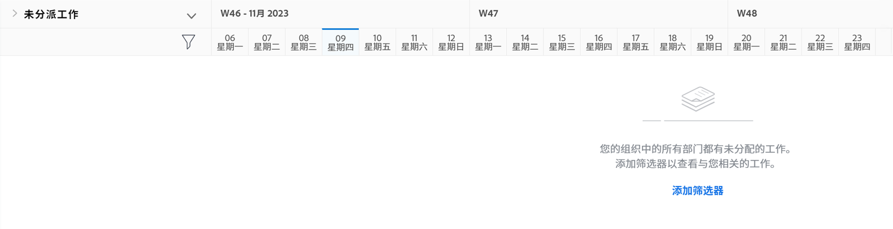

# 查找 [!DNL Workload Balancer]

了解哪些资源可用以及如何分配这些资源对于任何人来说都是一项具有挑战性的任务。 这就是为什么 Workfront 创建了 [!DNL Workload Balancer]。

其目的是让您更深入地洞察和管理您所管理的人员的每日和每周工作量。 这可以帮助您根据角色和可用性在多个项目中更好地分配任务。

* 单击 [!UICONTROL Main Menu] 中的 [!UICONTROL Resourcing]。
* 前往 [!UICONTROL Scheduling] 资源管理区域中的部分。
* 单击出现的 [!UICONTROL “Workload Balancer”] 部分。

## 工作负载平衡器内的区域

[!DNL Workload Balancer] 内出现两个部分：已分配的工作和未分配的工作。

已分配的工作区域显示用户列表以及已在 Workfront 中分配给他们的工作。 默认情况下，此区域会过滤出属于您所属 Workfront 团队的用户。 通过这种方式，您可以看到团队成员已被分配从事哪些工作。

未分配的工作区域显示仍需要分配给个人、工作角色或团队的工作。 但是，最初，该区域不会显示任何内容。

通过将“未分配的工作”区域设置为空白，您可以在进行分配之前首先在“已分配的工作”区域中关注用户当前的工作负载。
