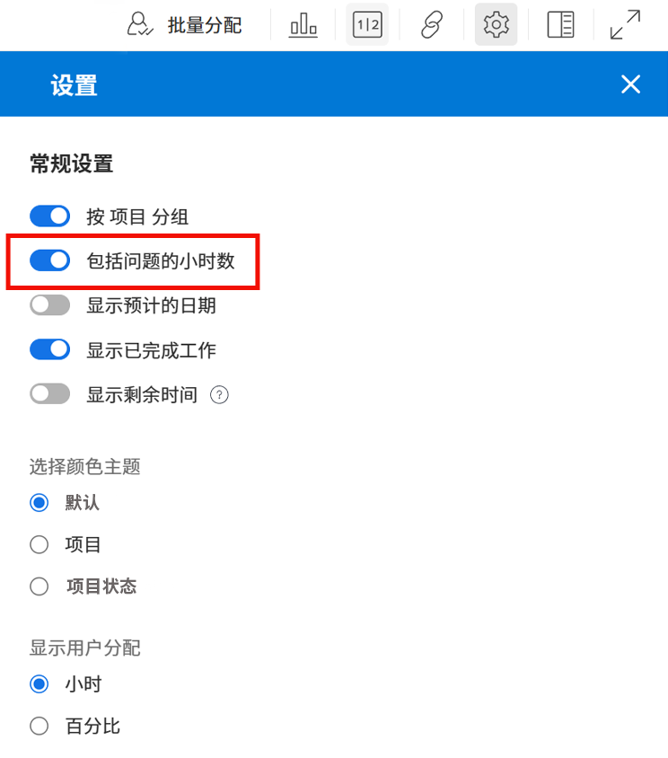
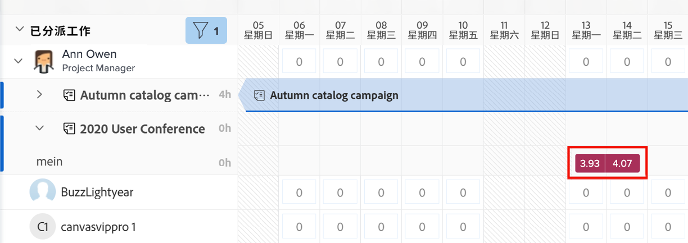
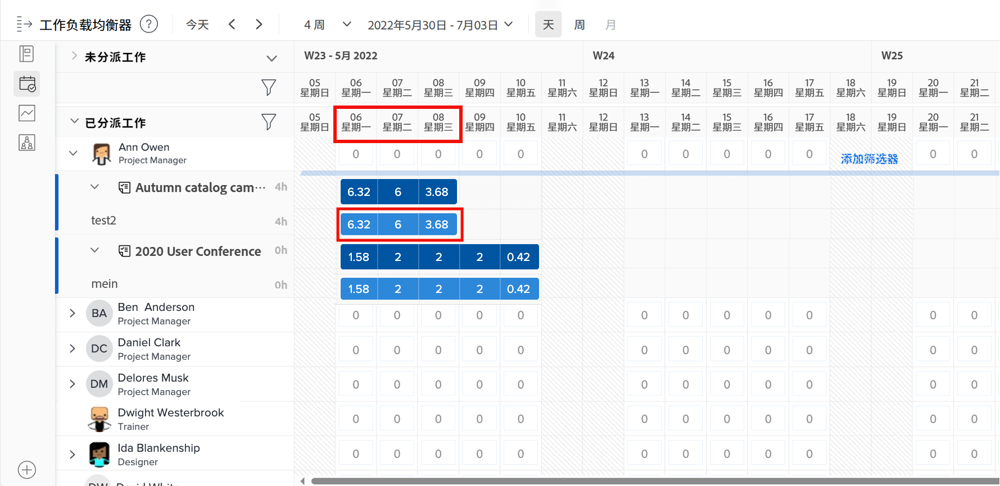
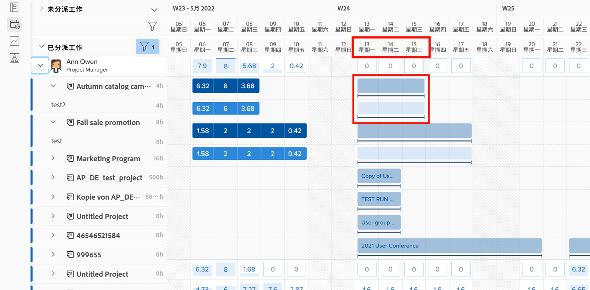
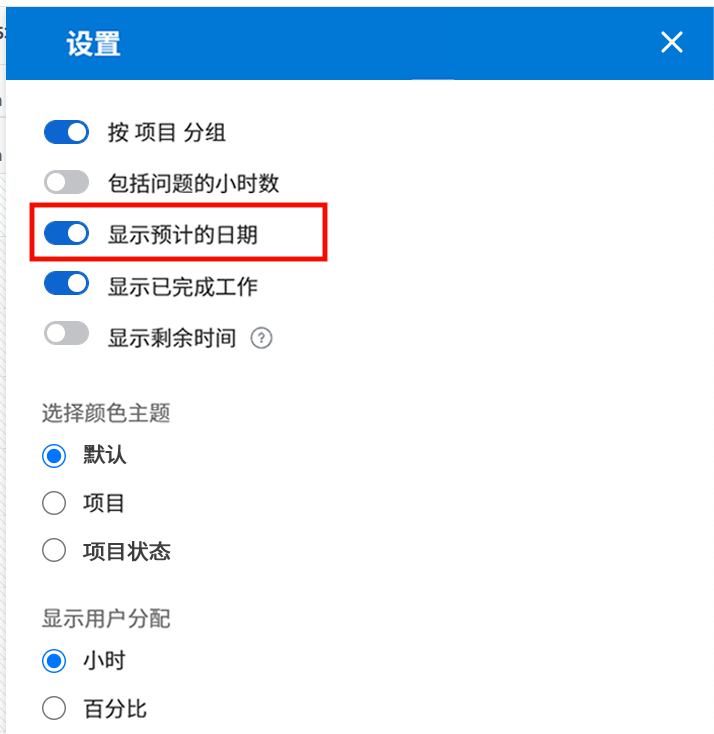
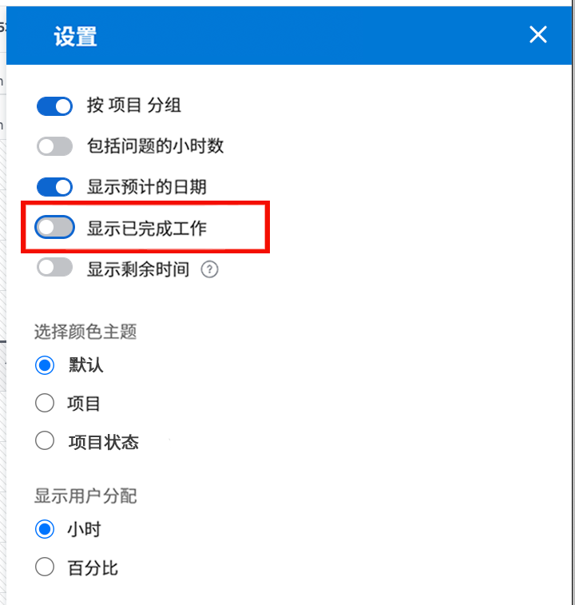

# 工作负载平衡器要考虑的设置

在您深入研究用户的各个工作负载时，需要考虑以下几个工作负载平衡器设置：

* 问题分配
* 预计日期
* 已完成的工作

可以通过负载平衡器设置图标打开或关闭这些设置。

## 包括来自问题的小时数

默认情况下，工作负载平衡器仅显示任务。 但是，可能会将用户分配给需要完成或解决的请求和问题，以及他们可能花费在项目工作上的时间。

为了更好地了解用户的完整工作负载，Workfront建议将问题包含在分配的用户工作列表中。

只需在“工作负载平衡器设置”区域中选中“包含从问题发生的小时数”选项。

在“已分配的工作”区域中，问题显示为浅红色条。

### 项目日期

通过负载平衡器设置提供的另一个选项是根据预计日期显示工作负载。

默认设置根据在项目中输入的计划日期显示分配的工作。

由于预计日期基于项目中先前任务的进度和完成情况，因此您能够“实时”查看任务的开始或结束时间，这在查看工作负载时特别有用。

您可以使用“工作负载平衡器”设置中的“显示预计日期”选项在查看计划日期和预计日期之间切换。

### 已完成的任务

已完成的任务与当前正在进行或即将开始的任务一起显示在工作负载平衡器中。 为了更好地了解用户可处理的其他工作，您可能希望排除已完成的工作。

在“工作负载平衡器”设置中取消选中“显示已完成的工作”选项。

