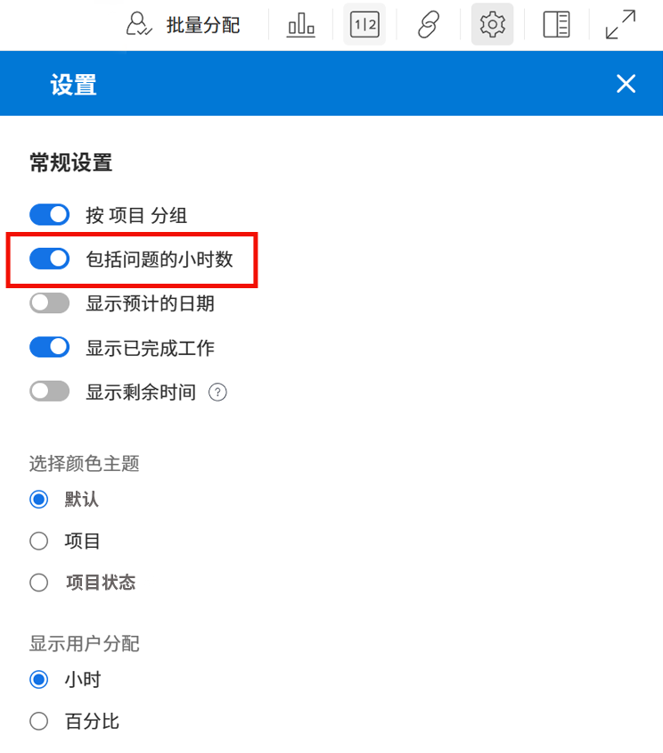
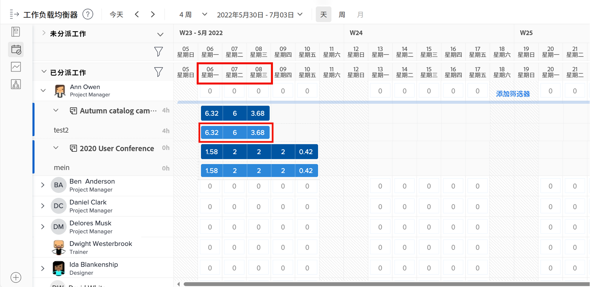
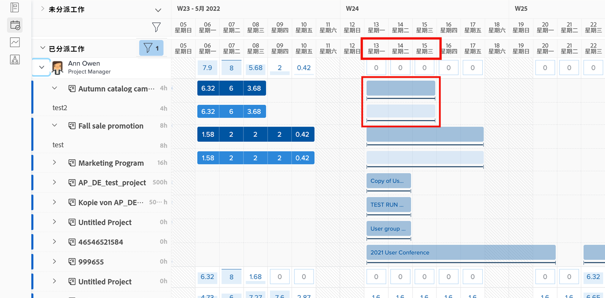
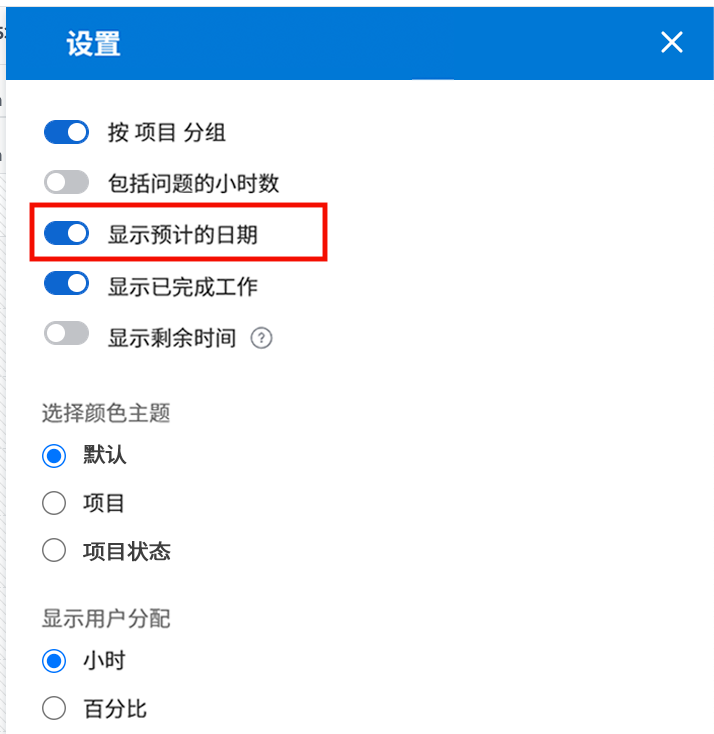

# 工作负载均衡器要考虑的设置

在深入研究用户的单个工作负载时，需要考虑工作负载平衡器的以下几项设置：

* 发出分配
* 预计日期
* 已完成的工作

这些可以通过工作负载平衡器设置图标打开或关闭。

## 包括来自问题的小时数

默认情况下，工作负载均衡器仅会显示任务。 但是，用户可能会被分配到需要满足或解决的请求和问题，而这会占用他们在项目工作上花费的时间。

为了更好地了解用户的所有工作负载，Workfront 建议在已分配用户的工作列表中加入问题。

只需选中工作负载均衡器设置区域中的“包含来自问题的小时数”选项即可。

在“分配的工作”区域中，问题会显示为浅栗色条。

### 项目日期

可通过工作负载均衡器设置提供的另一个选项是根据预计日期显示工作负载。

默认设置根据项目中输入的规划日期显示分配的工作。

由于预计日期是根据项目中先前任务的进度和完成情况来设定的，因此您可以获得任务何时开始或完成的“实时”视图，这在查看工作负载时特别有用。

您可以使用工作负载均衡器设置中的“显示预计日期”选项在查看规划日期和查看预计日期之间切换。

### 已完成的任务

已完成的任务以及当前正在进行或即将开始的任务会显示在工作负载均衡器中。 为了更好地了解用户可以承担哪些额外工作，您可能需要排除已完成的工作。

取消选中工作负载均衡器设置中的“显示已完成的工作”选项。

