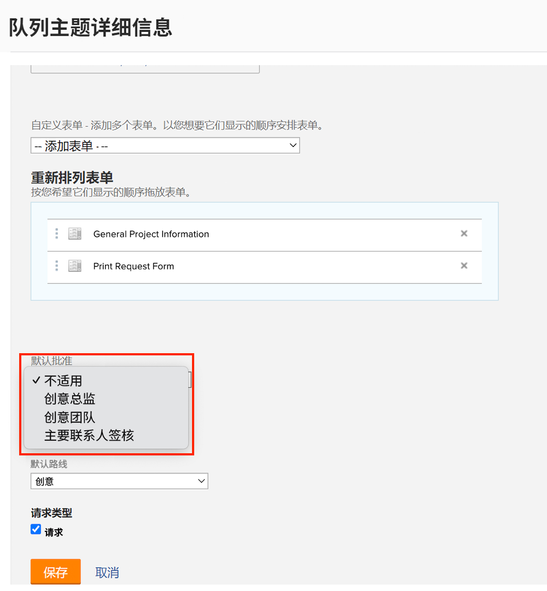
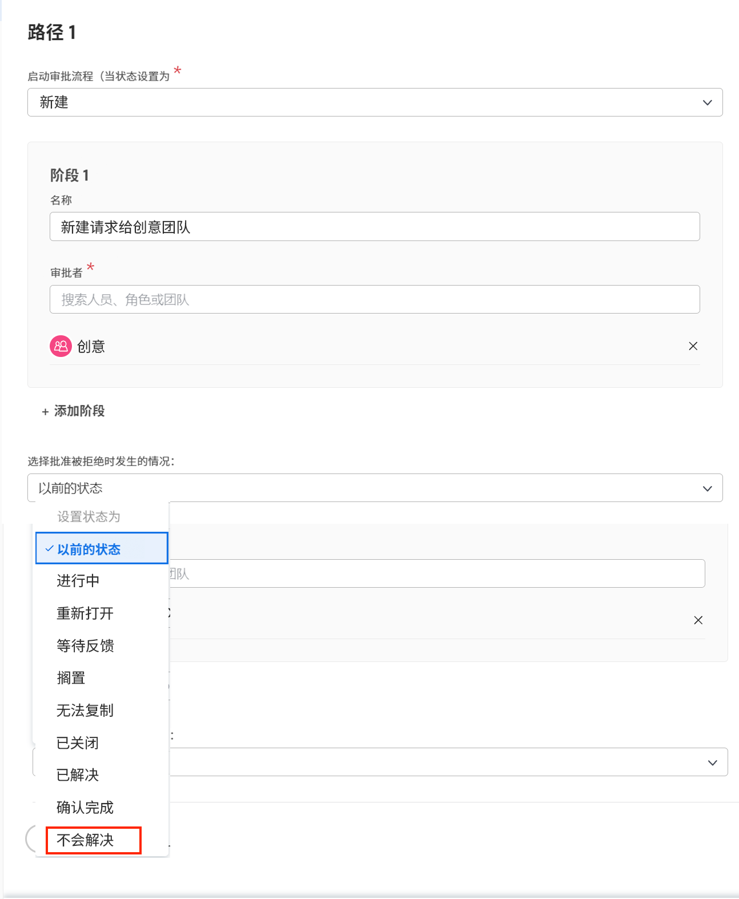

# 创建全局和一次性审批流程

项目、任务和问题的审批流程有助于项目经理能够在继续推动工作之前获得专业人员的确认，确定工作已经按照恰当的方式完成。项目经理可以为每种情况创建一个审批流程（这称为一次性审批流程），也可以从之前为满足常见需求而创建的审批流程（这些流程称为全局或现有审批流程）的列表中进行选择。

在任一情况下，当对象状态更改为审批流程中指定的状态时，审批人都会收到各种方式的通知，以便审查该项工作并审批或拒绝它。鉴于整个项目在等待审批时可能会暂停，审批人应提前意识到他们可能会被要求进行审批。如果审批人因任何原因不在办公室，他们可以将审批工作委托给符合资格的替代者。请参阅[委派任务、问题和审批](/help/manage-work/approval-processes-and-milestone-paths/delegate-approvals.md)，以了解详情。

在本视频中，您将了解如何为项目、任务或问题创建全局审批流程和一次性审批流程。

>[!VIDEO](https://video.tv.adobe.com/v/335225/?quality=12&learn=on)

>[!TIP]
>
>您可以将项目或任务的一次性审批流程添加到项目模板中。

>[!NOTE]
>
>您可以按照视频中对任务所述的相同方式，对项目和问题设置一次性审批。

## 如何在请求队列中应用自动问题批准

如果要在请求队列中设置自动问题批准，则只能使用全局问题批准流程完成这些操作，并在[!UICONTROL Queue topic]中应用。

创建或编辑[!UICONTROL Queue topic]时，在&#x200B;**[!UICONTROL Default Approval]**&#x200B;字段中选择全局审批流程。

您可能需要编辑问题批准流程，以确保批准被拒绝时&#x200B;**[!UICONTROL Previous status]**&#x200B;不是问题设置的内容。 这是因为以前的状态为&#x200B;**[!UICONTROL New]**，并且这也是触发审批流程的状态，因此它是审批时将设置的状态。 为避免在问题审批被拒绝时造成混淆，最好将状态设置为&#x200B;**[!UICONTROL Won't Resolve]**&#x200B;之类的内容，或为此目的创建的自定义状态。

## 有关此主题的推荐教程

* [委派任务、问题和审批](/help/manage-work/approval-processes-and-milestone-paths/delegate-approvals.md)
* [附加和编辑现有审批流程](/help/manage-work/approval-processes-and-milestone-paths/attach-and-edit-existing-approval-processes.md)
* [了解特定于组的审批流程](/help/administration-and-setup/approval-processes-and-milestone-paths/group-specific-approval-processes.md)
* [创建请求流量](/help/manage-work/request-queues/create-a-request-flow.md)

