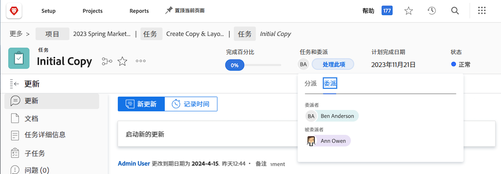

# 委派任务、问题和审批

了解如何将项目、任务、问题和工时记录卡的审批委派给其他Workfront用户。 还了解如何委派任务和问题分配。

## 委派审批

了解如何将项目、任务、问题和工时记录卡的审批委派给其他用户。

在本视频中，您将了解如何：

* 将审批分配给其他人
* 结束委派期
* 查找委托的审批

>[!VIDEO](https://video.tv.adobe.com/v/336094/?quality=12)

<!---
learn more URLS
Delegate approval request
--->

## 委派任务和问题分配

当您计划不在办公室时，您可以将分配给您的任务和问题委派给其他用户。

### 如何启用任务和问题分配委派

任务委派和问题委派必须先由组或系统管理员启用，然后才能使用。 此操作完成于 [!UICONTROL Setup > Project Preferences > Tasks & Issues > Delegation]. 启用此项将允许具有审阅或更高许可证的所有用户委派其分配的任务和问题。

![屏幕快照显示 [!UICONTROL Setup] 委派首选项](assets/delegation-1.png)

### 如何委派任务和问题分配

导航到 [!UICONTROL Home] 并单击 [!UICONTROL Delegate]，然后指定您委派所有已分配任务的用户和日期范围。 您可以指定具有“审阅”或更高许可证的任何用户。

![显示委派选项卡的屏幕快照 [!UICONTROL Home]](assets/delegation-2.png)

### 如何判断任务或问题是否已委派

您可以查看何时在中委派了任务或问题 [!UICONTROL Home] 或在任务或问题视图中。

![显示委派任务分配的屏幕快照 [!UICONTROL Home]](assets/delegation-4.png)

### 适用于已委派工作的电子邮件通知

您的组或系统管理员可以启用电子邮件通知，以便您委派任务和问题以及将某人的任务和问题委派给您的时候通知您。

![屏幕快照显示 [!UICONTROL Setup] 用于委派的电子邮件通知选项](assets/delegation-5.png)

