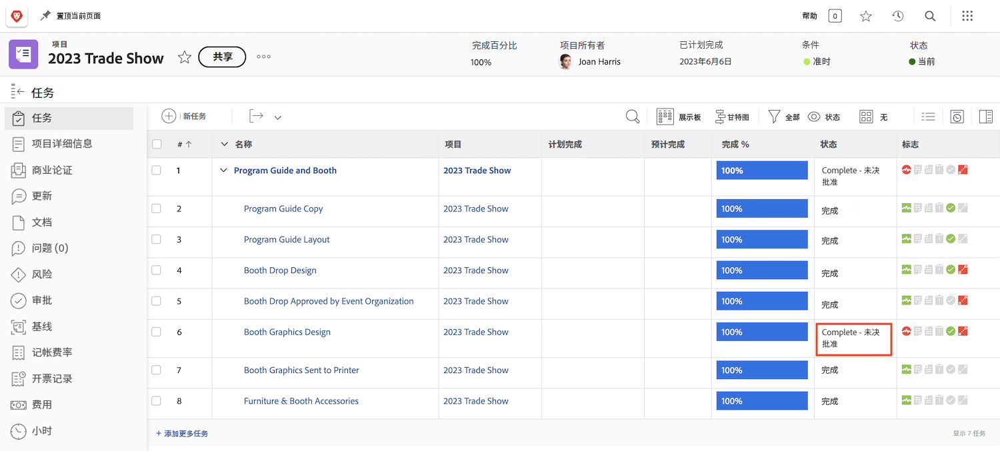
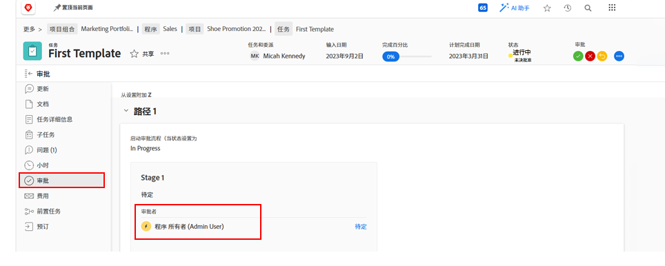

# 完成审批

任务和问题审批是许多工作流的一部分。 但是，未处理的审批将阻止您将项目状态设置为“完成”。

在 [!UICONTROL Task] 部分，请选择 [!UICONTROL View] 其中包括 [!UICONTROL Status] 列。 快速浏览该列将显示对具有&#39;&#39;的任务是否未完成批准[!UICONTROL - Pending Approval]”在状态的名称之后。

有几个选项可供您选择：

* **完成审批 —** 这可能意味着提醒其他人该未获批准。 您可以通过打开任务并单击“批准”选项卡来查看谁被分配为批准者。
* **删除审批 —** 如果不需要批准，则只删除它可能会更容易。 您能否做到这一点取决于您的 [!DNL Workfront] 权限。
* **更改状态 —** 如果不需要批准，您可以选择未附加批准的状态。 只需确保状态等同于“完成”。

如果贵组织在项目期间使用问题来跟踪问题、更改单或其他事件，请执行上的相同步骤 [!UICONTROL Issues] 部分。
