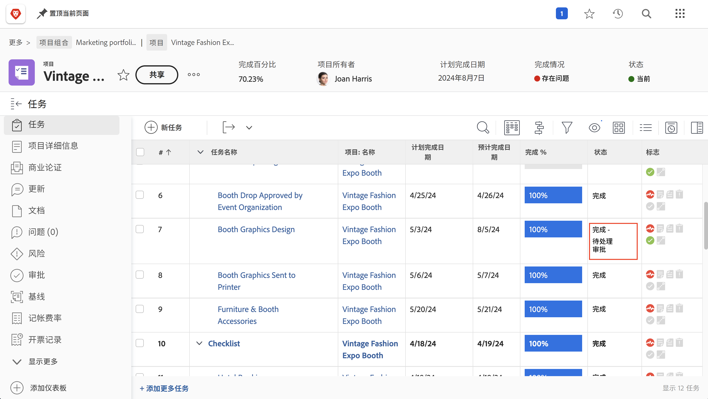
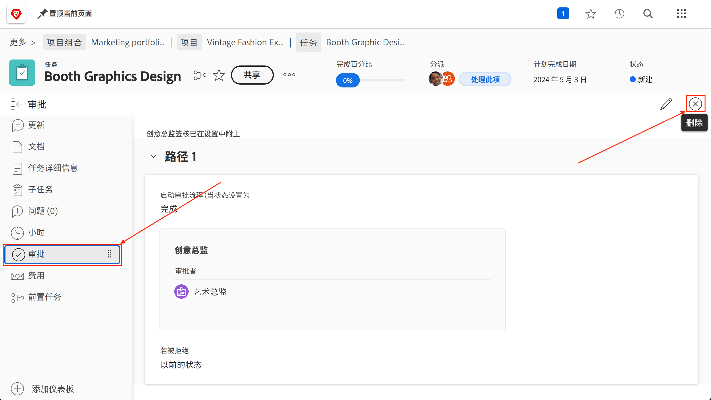

# 完成审批

任务和问题审批是许多项目的一部分。 但未解决的审批会造成您无法将项目状态设置为“完成”。

下面是如何找到并处理这些客户的。

在项目的[!UICONTROL Task]部分中，选择包含[!UICONTROL Status]列的[!UICONTROL View]，如[!UICONTROL Status]视图。 快速浏览该列将显示任务是否未完成审批，状态名称后面是否带有单词“[!UICONTROL - Pending Approval]”。

当发现某个任务仍在等待批准时，您有两个选项可以选择：

## 完成审批

这可能意味着提醒分派人员未完成的批准。 您可以通过打开任务并单击批准区域中的三个点菜单来查看谁被指定为批准者。

此时将出现一个框，显示分配的批准者。

## 移除审批

如果不需要批准，您可能需要将其删除。 您可以首先撤消批准，以执行此操作。 单击审批区域中的[!UICONTROL Recall]按钮。 这会将状态更改回其以前的状态，并允许您删除审批流程。

现在，单击左侧的[!UICONTROL Approvals]选项卡，然后单击右上角的[!UICONTROL Remove]按钮。

## 处理问题审批

如果您的组织使用问题来跟踪开展项目期间的问题、更改指令或其他事件，请按照项目 [!UICONTROL Issues] 部分的相同步骤进行操作。
