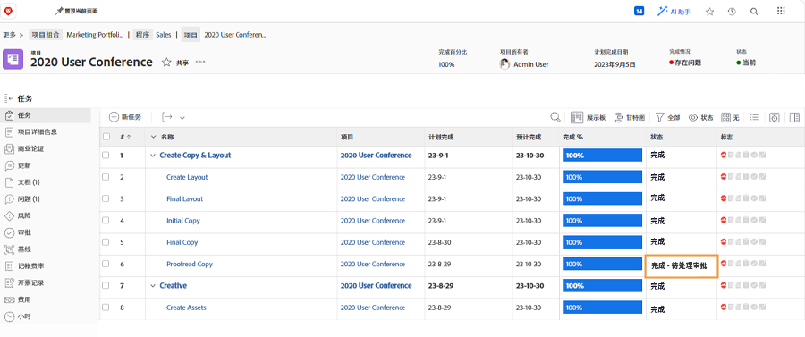

# 完成批准

任务和问题审批是许多工作流的一部分。 但是，未解决的审批可能会阻止您将项目状态设置为“完成”。

在 [!UICONTROL Task] ，请选择 [!UICONTROL View] 包括 [!UICONTROL Status] 列。 快速查看该列将显示是否对具有“[!UICONTROL -approval pending]“ ”。

您可以选择以下操作：

* **完成批准 —** 这可能意味着提醒其他人尚未批准。 通过进行更新以执行此操作 [!DNL Workfront]. 根据您的 [!DNL Workfront] 权限，则您可能能够自行完成批准。
* **删除批准 —** 如果不需要批准，则只删除它可能会更容易。 您的能力取决于您的 [!DNL Workfront] 权限。
* **更改状态 —** 选择未附加批准的状态。 只需确保状态等于“Complete”。

如果贵组织在项目期间使用问题来跟踪问题、更改订单或其他事件，请按照 [!UICONTROL Issues] 的子代。
