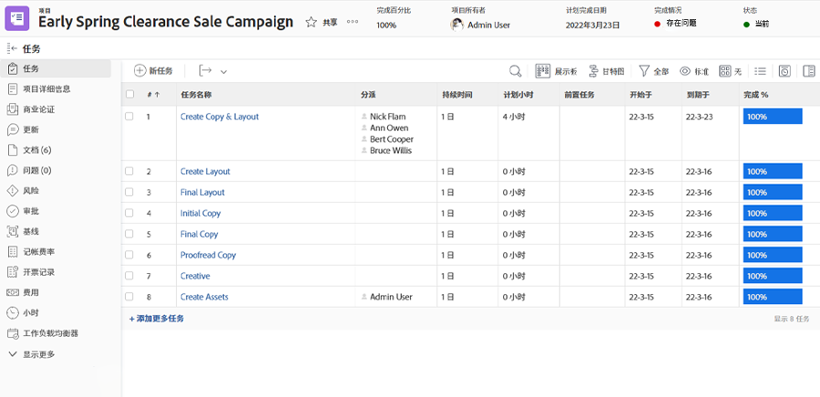

# 记录和审查时间

如果记录实际小时数是您组织工作流的一部分，您可以在项目的 [!UICONTROL Hours] 部分（从左侧面板菜单中选择它）查看这些小时数。这显示了在单个任务和项目本身上记录的所有小时数。您也可以从此页面记录小时数。

>[!NOTE]
>
>您的组织可能会要求您使用 [!DNL Workfront] 时间表审批小时数。与您的内部 [!DNL Workfront] 团队核实，看看您应该使用什么流程。

<!---
learn more url
Log time
--->
