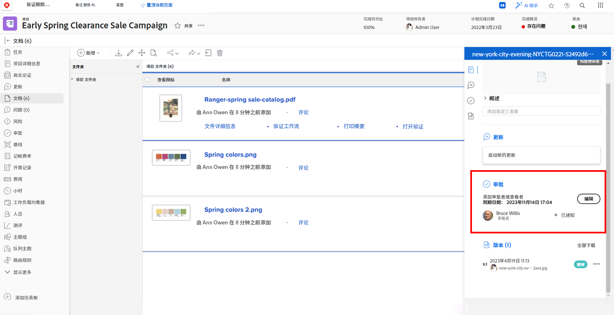

# 上传资源

在您关闭 [!DNL Workfront] 项目之前，确保所有相关文件都附加在 [!UICONTROL Documents] 部分。根据组织的指导原则，将这些文件作为文档或验证上传。

您可能需要将文档或验证作为现有文件的一个版本上传。

如果您的组织使用验证审批功能，请快速浏览一下进度图标，确保所有这些流程都已完成。

如果您的组织使用文档审批功能，请选择列表中的每个项目，并检查文档详细信息，以查看是否已完成审批。

<!---
learn more urls
Create proofs
Add new documents to Workfront
--->
