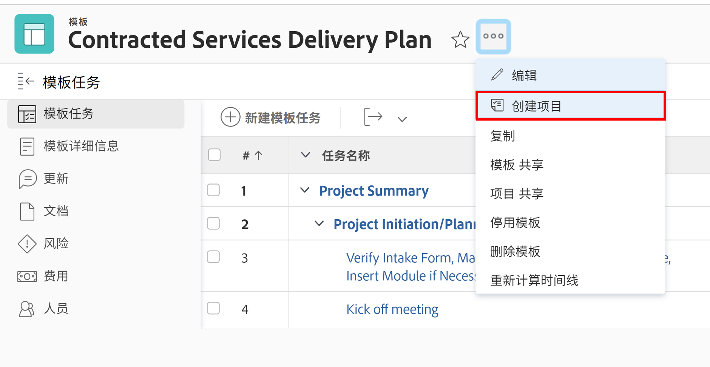
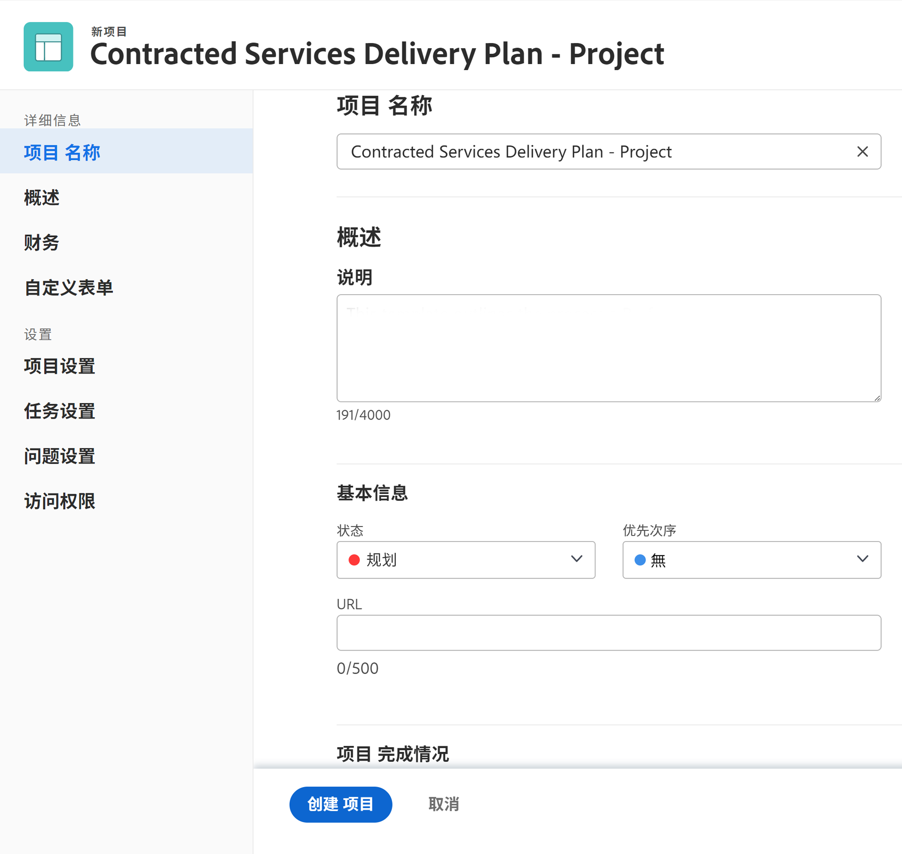
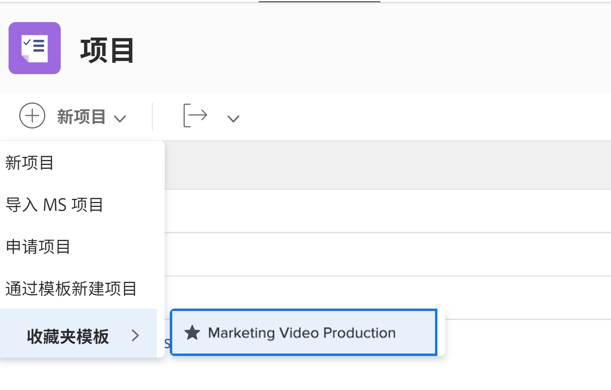

# 直接从模板创建项目

如果您刚好在使用某个模板，并且需要使用该模板创建项目，请单击模板名称旁边的3点菜单。 然后选择“创建项目”。

详细信息窗口允许您更改新项目的设置。

>[!NOTE]
>
>要使用此方法创建项目，您需要访问Workfront的“模板”区域。 如果您无法访问模板，则在转化问题/任务时，仍可使用模板从“项目”区域创建项目。

>[!TIP]
>
>如果您经常使用某个模板，请将其添加到收藏中！ 除了出现在导航栏的“收藏夹”菜单下外，您还会看到“新建项目”菜单中列出了该模板。

