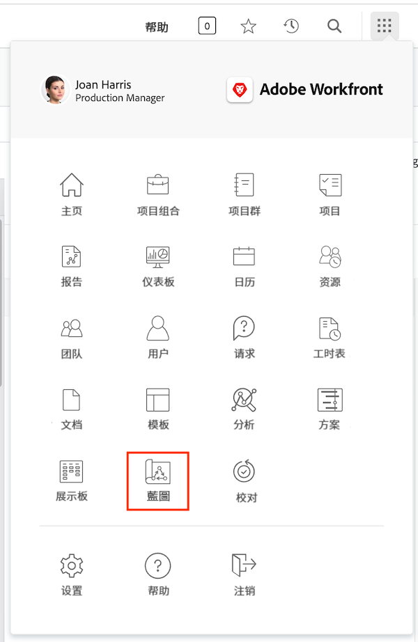
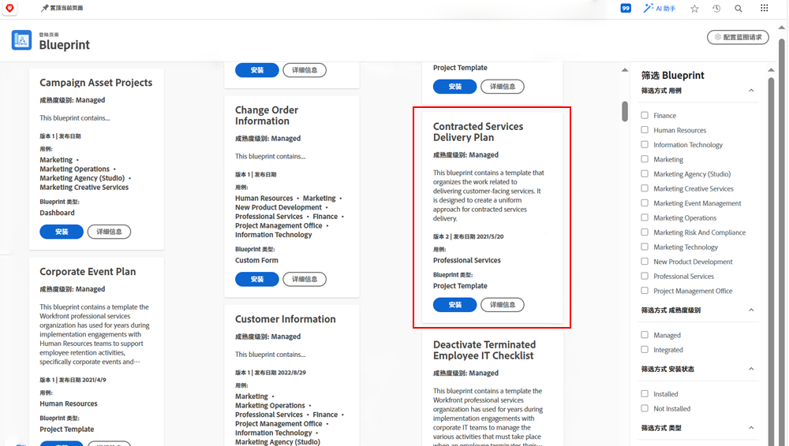
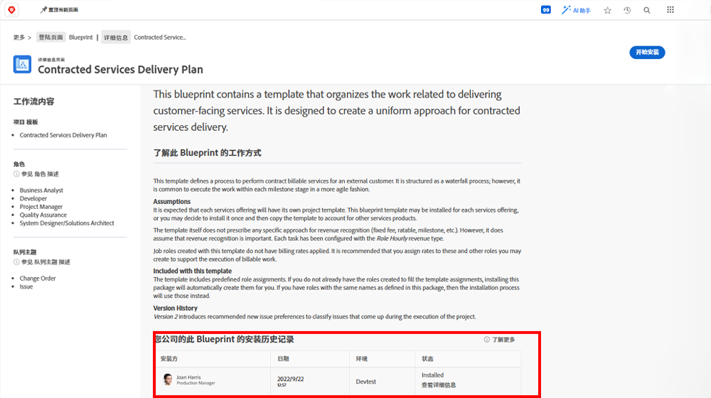
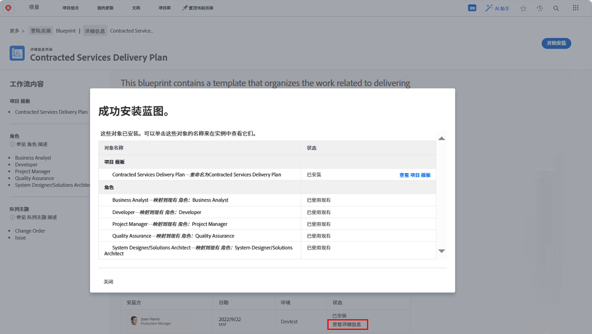

# 创建项目模板并了解 [!UICONTROL Blueprints]

学习如何从头开始以及从现有的项目创建项目模板，并了解如何通过 [!UICONTROL Blueprints] 访问由 Workfront 专家创建的各类实用项目模板。

## 创建项目模板

* 该视频提供了有关创建和使用营销视频制作模板的分步指南。其中首先说明了如何从头开始创建新模板，将其命名并保存。该流程涉及三个主要步骤：创建任务、使用持续时间和前置任务设置时间线，以及将任务分配给工作角色而不是个人用户。该视频强调以父子结构关系来组织任务，以便更好地总结并提高效率。
* 创建模板后，就可以使用它来制作新的项目。该视频演示了如何根据模板创建新项目、进行必要的调整以及根据需要添加任务或修改持续时间。它还说明了如何使用资源调度和规划功能给任务分配工作角色。
* 该视频介绍了如何将现有项目另存为新的模板，以便对工作流进行更新和改进。它强调了管理模板的重要性，以避免混淆并确保能够简化项目执行。

>[!VIDEO](https://video.tv.adobe.com/v/3415442/?quality=12&learn=on&captions=chi_hans)

## 要点

* **创建模板：**&#x200B;了解如何通过命名新模板、设置任务、时间线以及分配工作角色从头开始创建新模板。&#x200B;AEM
* **任务组织：**&#x200B;使用父子任务关系高效地组织任务，为项目提供清晰的摘要和结构。&#x200B;AEM
* **时间线设置：**&#x200B;使用持续时间和前置任务设置任务时间线，以准确估计时间范围和任务序列。&#x200B;AEM
* **基于角色的分配：**&#x200B;将任务分配给工作角色而不是单个用户，以有效利用资源计划和规划功能。&#x200B;AEM
* **模板管理：**&#x200B;将现有项目另存为新的模板以纳入改进内容，管理模板以避免混淆并确保能够高效地执行项目。&#x200B;

## 使用 [!UICONTROL Blueprints] 创建的模板

Workfront 用户可以使用 [!UICONTROL Blueprints] 来帮助构建项目模板。此功能位于主菜单中，您使用它可以访问针对某个部门和特定成熟度级别制作的预建、即用型模板。这些模板使用户能够在创建可重复的项目方面取得先机，并有助于保持范围相似的项目之间的一致性。

任何获得许可的用户都可以浏览 Workfront 中可用的 Blueprint 列表。创建新项目时（例如将任务或请求转换为项目），您无法直接应用 Blueprint。Blueprint 和项目模板之间的主要区别在于，Blueprint 用于制作模板，而模板则用于创建项目。**Blueprint 需要由系统管理员安装才能创建相应的模板。**

如果您发现看起来很有趣的 Blueprint，可以单击 **[!UICONTROL Details]** 了解更多信息。

[!UICONTROL Details] 屏幕解释了有关 Blueprint 的更多信息，其中包括安装历史记录（如果已安装 Blueprint）。

如果 Blueprint 已安装，您可以单击 **[!UICONTROL See details]** 获取已创建的模板以及为支持该模板而创建的任何其他对象的链接。

如果尚未安装 Blueprint，您可以向系统管理员请求安装。

## 有关此主题的推荐教程

* [直接从模板创建项目](/help/manage-work/create-and-manage-project-templates/create-a-project-directly-from-a-template.md)
* [共享项目模板](/help/manage-work/create-and-manage-project-templates/share-a-project-template.md)
* [复制现有项目](/help/manage-work/manage-projects/copy-an-existing-project.md)
* [停用项目模板](/help/manage-work/create-and-manage-project-templates/deactivate-a-project-template.md)
* [在项目模板中编辑项目团队](/help/manage-work/create-and-manage-project-templates/edit-the-project-team-in-a-project-template.md)
