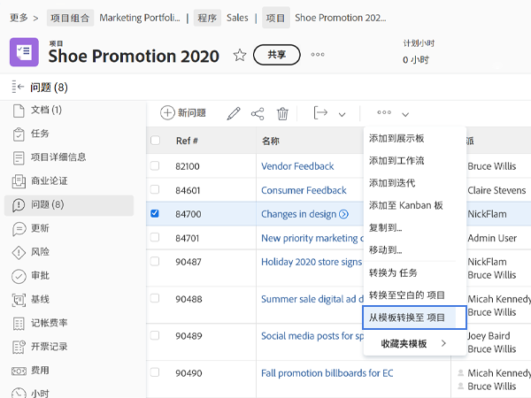

# 将问题转换为其他工作项

## 将问题转换为任务

问题可能足够重要，需要在项目时间表中考虑解决问题的时间和精力，并分配适当的资源。 在这种情况下，问题可以转换为任务。

![图像 [!UICONTROL Convert to Task] 中的问题选项 [!UICONTROL Workfront].](assets/15-convert-issue-to-task-menu-option.png)

1. 导航到 [!UICONTROL Issues] 记录问题的项目或任务部分。 或在您有权访问的报表中查找问题。
1. 单击问题名称以将其打开。
1. 从问题名称右侧的3个圆点菜单中，选择 **[!UICONTROL Convert to task]**.
1. 填写 [!UICONTROL Convert to task] 表单。 首先，为新任务提供名称和描述。
1. 如果新任务应属于其他项目，请输入项目名称。
1. 在 [!UICONTROL Options] 选中复选框以保留原始问题、允许访问新任务并维护完成日期。 进行这些选择时，请按照贵组织的工作流程操作。 如果要将自定义表单数据从问题传输到任务，请附加自定义表单。 （问题表单和任务表单中都存在的所有字段都将自动转移到任务表单中。）
1. 填写自定义表单（如果附加）。
1. 单击 **[!UICONTROL Convert to task]** 完成。

![图像 [!UICONTROL Convert to Task] 中的问题形式 [!UICONTROL Workfront].](assets/16-convert-to-task-options.png)

取决于贵组织的 [!DNL Workfront] 系统设置时，您可能无法更改“选项”部分中的设置。 这些选项会影响原始问题和新任务。

* **“保留原始问题，将其解决办法与这项任务挂钩”** 保留原始问题和相关信息（小时、文档等）。 选中此选项后，任务完成后，问题将标记为已解决。 如果未选择此选项，则任务完成时将删除原始问题。 这会影响贵组织跟踪和报告问题的方式。
* 的 **&quot;允许（用户名）有权访问此任务&quot;** 选项将允许创建问题的人员有权访问此新任务。
* 的 **“保留问题的计划完成日期”** 选项，可让您在问题上保留已设置的计划完成日期。 这会将任务约束设置为 [!UICONTROL Finish No Later Than]. 如果未勾选该框，则会设置任务的日期，就像在项目中创建新任务一样。

新任务位于项目任务列表的底部。 将任务移动到所需位置、为工作分配用户或团队、添加计划小时数和持续时间等。

>[!NOTE]
>
>您无法将问题添加到项目时间轴，因为它们表示“计划外工作”。 项目时间表用于“计划的工作”，即任务。

## 将问题转换为项目

有时，无法通过解决问题本身或将其转换为任务来解决问题，因为解决问题的过程需要更加复杂地协调。 在这种情况下，您可以将问题转换为项目。

1. 导航到已记录问题的项目或任务的“问题”部分。 或在您有权访问的报表中查找问题。
1. 单击问题名称以将其打开。
1. 单击问题名称右侧的3个圆点菜单，以显示“更多”菜单。
1. 然后，选择是要创建一个完全空白的新项目，还是要使用项目模板，该模板将预填充任务和时间轴信息。
1. 在“转换为项目”窗口中填写以项目名称开始的信息。
1. 按照您的团队或组织的要求，填写其他项目详细信息。
1. 在选项部分中，选中用于保留原始问题并允许访问新项目的复选框。 进行这些选择时，请按照贵组织的工作流程操作。
1. 填写自定义表单（如果附加）。 如果要将自定义表单数据从问题传输到项目，请附加自定义表单。 （问题表单和项目表单中存在的所有字段都将自动转移到项目表单。）
1. 单击 **转换为项目** 完成。

“转换为项目”窗口中显示的项目详细信息字段取决于用于创建项目的方法。 如果使用从模板转换到项目选项，则将在左侧菜单中看到更多信息。

>[!NOTE]
>
>某些部分（如选项部分）尽管可见，但可能无法访问，具体取决于贵组织的Workfront系统设置。

* 单击“**保留原始问题并将其解决方案绑定到此项目**“ ”选项。 此选项将保留原始问题和相关信息（小时、文档等）。 完成新项目后，问题将标记为已解决。 如果未选择此选项，则在项目完成时将删除原始问题。 这会影响贵组织跟踪和报告问题的方式。
* “**允许（用户名）有权访问此项目**“ ”选项允许创建问题的人员有权访问正在创建的项目。

## 在转换过程中维护信息

<!-- Need link to wf one doc article below 

To learn about what information transfers when you convert an issue to a task or project, we recommend you read through the conversion considerations in the article, Convert issues. This lists what information is kept when converting issues and what isn’t. Workfront recommends you become familiar with these considerations so you don’t lose important information when converting issues to tasks or projects.

-->

传输自定义表单数据需要以下任一条件：

* 同一自定义表单的多个副本 — 一个用于问题，另一个用于任务或项目。 这些自定义表单上的字段应完全匹配，因此信息可以从一个自定义表单传输到另一个自定义表单。

* 或选择问题、任务和/或项目对象的单个自定义表单。 使用此方法，您只需在单个自定义表单中创建和维护自定义字段即可。 这是一项最新的增强功能，与使用同一表单的多个副本相比，它更加简单，但无论使用哪种方法都可行。

<!-- Need link to wf one doc article below

Learn more in the article, Transfer custom form data to a larger work item.

-->

<!-- Pro tips graphic -->

如果在项目模板中包含自定义表单，则在转换过程中选择该模板时，将自动为其分配表单。

<!-- Learn more graphic and documentation article links 

* Convert issues
* Transfer custom form data to a larger work item
* Overview of resolving and resolvable objects
* Understanding resolving and resolvable objects
* Unlink issues from their resolvable objects

-->

## 将问题从任何问题列表转换为任务或项目

为了提高工作效率，并更便于在快节奏环境中转换问题，您能够将问题从项目、报表或功能板中的任何问题列表转换为任务或项目。 只需选择问题，然后单击显示的3个圆点菜单即可。

